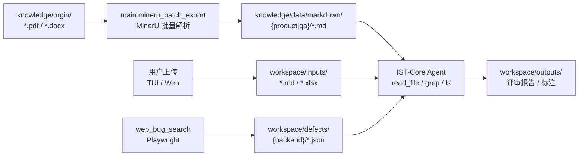
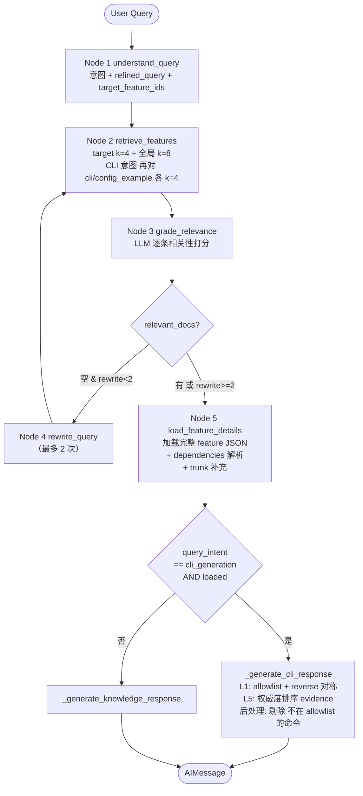
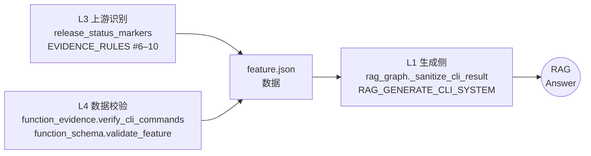
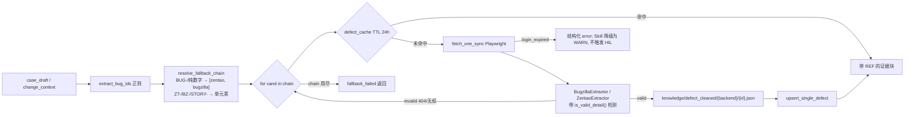
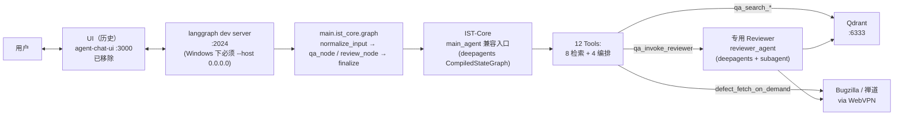

# InfoTest Engine 架构

本文档是 InfoTest Engine 的核心架构说明，覆盖端到端数据流、模块职责、以及历史兼容性机制。

为了进一步深入理解系统的设计细节，请阅读以下底座架构设计文档：
- **V8 编译引擎(现役主路)**：[docs/DESIGN_v8_engine.md](docs/DESIGN_v8_engine.md) (事件溯源台账、LangGraph StateGraph、质量门与知识闭环;V6 历史版见 docs/archive/DESIGN_v6_engine.md)
- **深度记忆系统**：[docs/memory_system.md](docs/memory_system.md) (L1/L2/L3层、庄周梦蝶 DreamTask、足迹 Footprint 知识树)
- **零信任多根沙箱**：[docs/file_sandbox.md](docs/file_sandbox.md) (多根路径、遍历防护、三闸与四闸拦截防御)
- **KMS 知识管线**：[docs/kms_pipeline.md](docs/kms_pipeline.md) (去向量化 RAG 决策、知识库/工作区分流、Markdown 高保真直出)
- **TUI 界面与状态网络**：[docs/tui_architecture.md](docs/tui_architecture.md) (Textual/Web 双模终端、EventBus 被动式状态观测、性能防御与折叠渲染)

## 0. 命名与兼容演进

- 项目展示名：**InfoTest Engine**。
- Agent 核心展示名：**IST-Core**。
- **重构升级（2026-05-24）**：为了响应最新规范，代码包路径已经自 `main.qa_agent`、`tests/qa_agent` 统一升级迁移至 `main.ist_core` 与 `tests/ist_core`。在重构过后的状态类中，类名由原来的 `QaAgentState` 升级为 `IstCoreState`，事件类型由 `QaAgentEvent` 升级为 `IstCoreEvent`。
- **外部 API 兼容层**：在 LangGraph 外部调用、TUI 渲染、命令行接入以及 langgraph.json 注册中，编译和通信 Graph ID 保留为 `qa_agent` 指针，以防破坏外部系统的连接和历史回放。
- 文档中出现 `main_agent` 时，指 IST-Core 核心执行逻辑；运行时工具名前缀依然为 `qa_deepagent_*` 与 `@tool` 的 `qa_*` 以确保向前兼容。

## 1. 端到端数据流



所有路径均相对仓库根。`knowledge/orgin` 拼写固定（trunk_id / stem 依赖），不要改为 `origin`。

> **注意**：上述 Qdrant / RAG / feature extraction 管线为 v1.0-v1.5 历史架构，当前已简化收口（详见 CLAUDE.md "架构原则"）。当前 IST-Core 数据流为：orgin → mineru → markdown 直出 + agent 直读。

## 2. RAG 6 节点流程



**L1 生成侧硬规则**（见 `main/rag_prompts.py`）：

- 只允许输出 `cli.commands[].command` 中已逐字出现的命令；禁折叠 `{on|off}` 为 `on`
- `evidence.role ∈ {design, solution_specification}` 且 `quoted_text` 不含命令字符串 → 降级为"设计阶段未发布"
- `protocol_limitations[]` 与 `constraint_warnings[]` 分节
- `reverse_cli` 必须语法对称（on↔off / enable↔disable / `no <cmd>`）
- 禁用 NETCONF/YAML 风格的假命令（`http2-enabled true` 等）
- 每条 CLI 步骤必须附 evidence 摘要（`source_file` + `quoted_text` 首 100 字）

**后处理过滤**：`_sanitize_cli_result` 剔除 steps[].cli 不在 allowlist 的整条；剔除不对称的 reverse_cli。

## 3. 三层 CLI 幻觉闸门



三层互为备份：

- **L1** 保证即使 feature.json 被污染，RAG 也不会让未认可的命令进入回答
- **L3** 保证未来跑抽取时 deferred / 模板占位不会进入 `cli.commands[]`
- **L4** 保证 feature.json 落盘前 CLI 完整性（release_status / reverse 对称 / substring 回溯）

## 4. 模块职责表

### `main.common/` — 通用工具 + 外部依赖封装

| 模块 | 职责 |
|------|------|
| `paths` | 路径常量 + `source_authority()`（L5 权威度表） |
| `env` | 根目录 `environment` 文件加载 |
| `llm_cache` | `function_llm` 文件级 LLM 调用缓存 |
| `utils` | JSON I/O、SHA256、原子写入 |
| `progress` | 单行刷新进度条（daemon 线程） |
| `cli_commands` | CLI 命令字符串工具（L1/L3/L4/L5 共用） |
| `release_markers` | deferred / template_placeholder 识别（L3） |

### `main.ingest/` — MinerU → 清洗 → trunk

| 模块 | 职责 |
|------|------|
| `batch_export` | 调 MinerU API 批量解析源文档 |
| `merged_pre_data` | 合并解析结果 + hash 缓存 |
| `pre_data_clean` | `filter_schema_version=7` 清洗规则（见本文档附录 A） |
| `trunk_merged` | `trunk_schema_version=2`，L3 打 `release_status` + `unit_kind_override` |

### `main.extraction/` — 特征抽取

| 模块 | 职责 |
|------|------|
| `discover` | Step 0 / 0.5 / 0.7：unit-capsule 发现 + LLM 关联 + 细化 + 补录 |
| `assemble` | Step 1：按特征组装 `=== SOURCE ===` / `=== EVIDENCE_UNIT ===` locator |
| `extract` | Step 2：11 批次（B01–B11）并发 LLM 抽取 |
| `evidence` | Step 3：evidence 校验 + patch（含 L4 `verify_cli_commands`） |
| `schema` | Step 4：feature schema + ID 规范化（含 L3 CLI 完整性） |
| `prompts` | 11 批次 prompt 模板 + `EVIDENCE_RULES`（含 L3 规则 6–10） |
| `llm` | DashScope qwen-plus 客户端（3 次指数退避 + 429 处理） |
| `cli_param_repair` | 空 range / enum / default 的 LLM 补全 |
| `pipeline` | `process_one_feature` + CLI `main` |

### `main.indexing/` — Qdrant 向量索引

| 模块 | 职责 |
|------|------|
| `feature_index` | `doc_type=feature_json`，按 section 切片索引 |
| `trunk_index` | `doc_type=trunk_unit`，跳过 `unit_kind=template_placeholder` |
| `index_all` | 先 feature 后 trunk 一键索引 |

### `main.rag/` — RAG 运行时

| 模块 | 职责 |
|------|------|
| `state` | LangGraph State TypedDict |
| `prompts` | 各节点 system prompt（含 L1 CLI allowlist 规则） |
| `tools` | feature / trunk 向量检索 + feature 详情加载 |
| `graph` | 6 节点 StateGraph 构建 + 生成（含 L1 sanitize / L5 authority） |
| `runner` | CLI 入口 |
| `nodes/{understand,retrieve,grade,rewrite,load,generate}` | 按节点粒度的访问点 |

## 5. Qdrant Collection Schema（历史保留，已下线）

> **状态：legacy**。`CLAUDE.md` 第 15 行：「不再做 LLM 特征抽取 / Qdrant 向量索引 / RAG 检索」。本节为历史架构记录，相关代码与 env（`QDRANT_*`、`langchain-qdrant`、`qdrant-client`）已从 `requirements.txt` 与运行时移除。新 IST-Core 走 `read_file` / `grep` / `ls` + LLM 直读直写。

集合 `ultra_agent_vectors`（env `QDRANT_COLLECTION_NAME` 可覆盖）；feature + trunk 共用，用 `doc_type` 区分。
QA 数据走独立集合 `ultra_agent_qa`（env `QDRANT_QA_COLLECTION` 可覆盖）。

向量维度 1024、Cosine 距离、DashScope `text-embedding-v4`。可过滤的 metadata 字段
通过 `client.create_payload_index(field_schema=KEYWORD)` 注册（`main/feature_index.py::PAYLOAD_INDEX_FIELDS` 与
`main/qa_index/qdrant_index.py::QA_PAYLOAD_INDEX_FIELDS`），新增字段无需 drop 集合。

### 5.1 doc_type = `feature_json`

按 `feature.json` 的 section registry 切片。每条 Document 的 `page_content` 以 `retrieval_text` 为主干 + section 头 + text_fields。Evidence 已在 `feature_strip_evidence` 中剥离。

| metadata 字段 | 示例 | 是否可过滤 |
|--------------|------|----------|
| `feature_id` | `apv.http2.slbservice.virtual_service` | ✅ |
| `feature_name` | `HTTP/2 Virtual Service` | 否 |
| `product_family` | `APV` | ✅ |
| `source_file` | `apv.http2.slbservice.virtual_service.feature.json` | 否 |
| `doc_type` | `feature_json` | ✅ |
| `section` | `cli` / `requirements` / `constraints` / ... | ✅ |
| `item_id` | `CLI-VIRTUAL_SERVICE-SUFFIX` / `REQ-VIRTUAL_SERVICE-001` | ✅ |
| `chunk_index` / `chunk_count` | 0 / 42 | 否 |

### 5.2 doc_type = `trunk_unit`

trunk 的每个 unit 一条 Document；template_placeholder 的 unit 被**整个跳过**。

| metadata 字段 | 示例 | 是否可过滤 |
|--------------|------|----------|
| `doc_type` | `trunk_unit` | ✅ |
| `trunk_id` | `cli_215-216_trunk_0000` | ✅ |
| `unit_id` | `cli_215-216_trunk_0000_unit_00` | ✅ |
| `stem` | `cli_215-216` | ✅ |
| `section_title` | `HTTP/2 虚拟服务支持` | ✅ |
| `unit_kind` | `content` / `title` | ✅ |
| `release_status` | `released` / `deferred` | ✅（L3 新增） |
| `source_file` | `cli_215-216.pdf` | 否 |
| `local_heading` | "" | 否 |

可过滤字段集合来自 `main/feature_index.PAYLOAD_INDEX_FIELDS`（写入时 Qdrant 会以 `metadata.<field>` 形式存放并建立 keyword 索引）。

### 5.3 IST-Core 兼容层引入的新 doc_type（v1.4，`ultra_agent_vectors` 共享集合）

详见 `main/indexing/qa_assets_index_all.py`。集合级 payload index 由 `main/indexing/_qa_asset_base.py::COMMON_PAYLOAD_FIELDS` 合并进 `feature_index.PAYLOAD_INDEX_FIELDS`；新增字段无需 drop 集合。

| doc_type | 索引脚本 | 关键 metadata（全部可过滤）|
|----------|---------|--------------------------|
| `test_case` | `main.indexing.test_asset_index` | `case_id`, `component`, `category`, `related_feature_id`, `related_spec_ids`, `upstream_case_ids`, `risk_tags` |
| `test_spec` | `main.indexing.test_asset_index` | `spec_id`, `component`, `related_feature_id` |
| `test_baseline` | `main.indexing.baseline_index` | `baseline_id`, `category`, `required_subscenes`, `naming_pattern`, `min_expected_count`, `must_have_fields` |
| `bug` / `plm_ticket` | `main.indexing.defect_index` | `ticket_id`, `module`, `severity`, `status`, `affected_versions`, `fixed_commit`, `backend` |
| `requirement` | `main.indexing.requirement_index` | `req_id`, `module`, `release_version`, `priority` |
| `code_change` | `main.indexing.code_change_index` | `commit`, `module`, `affected_files`, `branch` |
| `release_scope` | `main.indexing.release_scope_index` | `release_version`, `feature_id`, `module`, `release_status` |
| `knowledge_reference` | `main.indexing.knowledge_ref_index` | `topic`（osi/tcp/http/linux/dns）, `ref_id` |

共享确定性 id：`sha256(doc_type + 关键字段)`；上层结构化 id 会在 `UltraQdrantVectorStore.add_texts` 里转成稳定 UUID。

## 6. 源文档权威度（L5）

见 `main/knowledge_paths.py`：

| 模式 | 权威度 | 典型文件 |
|------|--------|---------|
| `^cli_` | 100 | `cli_191-192.pdf`, `cli_215-216.pdf` |
| `^app_` | 80 | `app_191.pdf`, `app_300-308.pdf` |
| 默认（未匹配） | 50 | 其它 |
| `^APV_.*spec` | 40 | `APV_SLB_HTTP2_spec.docx` |
| `phaseII` | 35 | `APV_SLB_HTTP2_spec_phaseII.docx` |
| `Design_Doc` | 20 | `HTTP2_Design_Doc.docx` |
| `Project_Status` | 15 | `IPv6_Project_Status.docx` |

**用途**：在同一命令有多条 evidence 时，`cli_command_utils.sort_evidences_by_authority` 把高权威源排前，供 RAG 呈现和未来检索过滤。

## 7. 环境变量规范

在项目根目录 **`environment`** 文件中配置（无扩展名，已在 `.gitignore`）。详见 `environment.example` 的 7 个分区：API 凭证 / 模型路由 / 持久化 / 记忆 / Postgres / 缺陷库 / KMS。最小集：

```bash
MINERU_TOKEN=xxx
OPENAI_API_KEY=xxx                     # 统一 OpenAI 兼容端点
OPENAI_BASE_URL=https://token-plan-cn.xiaomimimo.com/v1   # 留空走默认 MiMo CN
IST_MODEL=mimo-v2.5-pro
IST_SQLITE_PATH=./ist_core.sqlite
```

**运行时开关**：

| 变量 | 取值 | 说明 |
|------|------|------|
| `NO_PROGRESS` | `1` | 禁用终端进度条（CI 友好） |

**加载逻辑**：`main.langchain_env.langchain_load_dotenv_if_present`（基于 `python-dotenv`，`override=False`，不会覆盖已存在的环境变量）。

## 8. 常用命令速查

> **状态：legacy（v1.0-v1.5 全量管线，已下线）**。本节的 `feature_create.ps1` / `python -m main.index_all` / `migrate_to_qdrant` / `mineru_merged_pre_data` / `mineru_pre_data_clean` / `mineru_trunk_merged` / `function_trunk_create` / `cli_param_repair` / `fix_http2_deferred` / `rag_function.ps1` 等命令对应的模块已移除（v1.0.5 仓库清理），当前代码树**不可直接 `python -m` 调用**。当前有效命令仅见 `CLAUDE.md` 「常用命令」与 README；KMS 管线入口为 `python -m main.mineru_batch_export` / `python -m main.xlsx_to_markdown`。以下保留作历史架构参考。

### 全量管线（数据入库）

```powershell
.\feature_create.ps1                       # 一键 Step 1-5
.\feature_create.ps1 -FromPreset           # 复用 preset
.\feature_create.ps1 -Feature dns64 -Force # 仅单 feature，强制重抽
```

### 单步

```bash
python -m main.mineru_batch_export            # Step 1
python -m main.mineru_merged_pre_data         # Step 2
python -m main.mineru_pre_data_clean          # Step 3
python -m main.mineru_trunk_merged            # Step 4
python -m main.function_trunk_create          # Step 5
python -m main.cli_param_repair               # 可选：CLI 参数补全
```

### 索引

> 前置：先启动本地 Qdrant 容器（podman + storage 卷）：
>
> ```bash
> podman machine start
> podman run -d --name qdrant_ultra -p 6333:6333 -p 6334:6334 \
>   -v $(pwd)/qdrant_storage:/qdrant/storage:Z \
>   --user 0:0 --restart unless-stopped \
>   docker.m.daocloud.io/qdrant/qdrant:latest
> ```

```bash
python -m main.index_all                    # feature + trunk + QA
python -m main.index_all --features-only    # 仅 feature
python -m main.index_all --trunks-only      # 仅 trunk
python -m main.index_all --qa-only          # 仅 QA
python -m main.migrate_to_qdrant            # 一键回灌全部 + collection counts
```

### RAG

```powershell
.\rag_function.ps1 -Query "如何配置 HTTP/2 SLB 服务？"
.\rag_function.ps1 -Interactive -Verbose
```

### 一次性数据修复（仅 http2 系列）

```bash
python -m main.fix_http2_deferred             # dry-run
python -m main.fix_http2_deferred --apply     # 写回 5 个 http2 feature.json
python -m main.fix_http2_deferred --apply --reindex  # 并触发 Qdrant 重灌
```

### 测试

```bash
pytest main/tests/ -m "not e2e"               # 档位 1：纯本地（schema / CLI 工具 / 快照）
pytest main/tests/ -m e2e                     # 档位 2：真实 Qdrant + DashScope（缺 key 立即 fail）
```

## 9. feature.json 关键字段示例

```jsonc
{
  "feature_id": "apv.http2.slbservice.virtual_service",
  "feature_name": "HTTP/2 Virtual Service",
  "summary": "...",
  "requirements": [
    { "id": "REQ-VIRTUAL_SERVICE-001", "statement": "...", "evidence": [...] }
  ],
  "constraints": [
    { "id": "CON-VIRTUAL_SERVICE-001", "title": "TLS 版本强制约束", ... }
  ],
  "scope": {
    "out_of_scope": {
      "unsupported_protocols": [],
      "unsupported_scenarios": [
        "[deferred] CLI 命令 `http2 maxstream virtual <vs_name>` 在当前发布版本中不可用..."
      ]
    }
  },
  "cli": {
    "commands": [
      {
        "id": "CLI-VIRTUAL_SERVICE-SUFFIX",
        "command": "http2 virtual {on|off} <virtual_service>",
        "reverse_command": "http2 virtual off <virtual_service>",
        "release_status": "released",     // L3 新增（可省略，默认 released）
        "evidence": [
          { "source_file": "cli_215-216.pdf", "quoted_text": "http2 virtual {on|off}..." }
        ]
      }
    ],
    "deferred": [                          // L2/L3 新增
      {
        "command": "http2 maxstream virtual <vs_name>",
        "reason": "deferred",              // deferred / template_placeholder / design_orphan
        "evidence": [...]
      }
    ]
  },
  "configuration_example": {
    "sample_cli": [
      "http2 virtual on vs_https_app"      // 每条必须能回溯到 cli.commands[].command
    ]
  }
}
```

## 10. 相关文档

- [README.md](README.md) — 快速开始 / 目录结构 / 环境变量
- [CLAUDE.md](CLAUDE.md) — AI 助手速查
- [ARCHITECTURE.md 附录 A](#附录-a预清洗规则设计mineru_pre_data_cleanpy) — `mineru_pre_data_clean` + trunk 的 L3 规则主文档

## 11. IST-Core 兼容层（v1.4）速览

```
main/ist_core/            # 顶层 StateGraph + IST-Core / 专用 Reviewer 兼容实现（deepagents）+ Tool + Sink
  ├─ state.py / schemas.py / graph.py / runner.py / events.py / streaming.py
  ├─ agents/{main_agent.py, reviewer_agent.py, _llm.py}
  ├─ tools/{qa_search_product_kb, qa_search_assets, defect_search_kb,
  │         qa_trace_change, qa_load_baseline_rules,
  │         qa_search_knowledge_ref}.py + _shared.py
  └─ sinks/{cli_sink, jsonl_sink, langsmith_sink}.py

main/indexing/            # 7 个新索引脚本 + 聚合入口
  ├─ _qa_asset_base.py（共享工具 + COMMON_PAYLOAD_FIELDS）
  ├─ test_asset_index.py / baseline_index.py / defect_index.py
  ├─ requirement_index.py / code_change_index.py
  ├─ release_scope_index.py / knowledge_ref_index.py
  └─ qa_assets_index_all.py   # 一键索引全部通道

main/ingest/html_extractors/     # §15 HTML 抓取（Playwright + BeautifulSoup）
  ├─ schema.py + selectors.yaml（集中配置）
  ├─ bugzilla.py / zentao.py / plm.py（zentao 别名）/ _common.py
main/ingest/defect_{fetch,parse,refresh_all}.py

skills/                    # Deep Agents Skill（parent 2 + sub 7）
  ├─ Product_QA/ Review_Checklist/
  └─ Sub_{QaCaseParser,QaChangeTracer,QaCoverageAnalyst,QaBaselineAuditor,
          QaSpecChecker,DefectMiner,QaTheoryAdvisor}/

tests/ist_core/            # smoke + event_contract + eval + 3 datasets
tests/ingest/              # extractor contract + golden fixtures
tests/fixtures/defect_html/{bugzilla,zentao}/  # sample_*.html + expected_*.json
```

### 11.1 缺陷库按需抓取闭环（v1.5.2，`defect_fetch_on_demand` Tool + Bugzilla→禅道 fallback chain）



- Reviewer 下的 `defect_miner` 与 `qa_change_tracer` subagent 均挂 `defect_fetch_on_demand`
- 单 run 内 on-demand 调用上限：`defect_miner=3` / `qa_change_tracer=2`
- **Bugzilla → 禅道 迁移期 fallback chain（v1.5.2）**：
  - 触发条件：`backend="auto"` 且 id 前缀模糊（`BUG-` / 纯数字 / 中文"缺陷/问题"）
  - chain 顺序由 `DEFECT_FETCH_AUTO_CHAIN`（默认 `zentao,bugzilla`）控制
  - 每个候选独立查 cache → fetch → parse → `is_valid_detail()` 检测
  - 失败页面信号（被 extractor 写入 `invalid_reason`）：
    - Bugzilla：`"there is no bug with the id"` / `"you are not authorized to access bug"` / `"bug not found"` 等
    - 禅道：`"您没有访问权限"` / `"没有匹配的结果"` / `"bug 不存在"` 等
  - 第一个 `is_valid_detail=True` 即写入 cache + 返回；返回 JSON 含 `fallback_chain_used` / `fallback_tried[]` 调试信息
  - chain 全部失败 → `error: "fallback_failed"`；Reviewer Skill 据此降级为 D2 WARN
- **明确前缀**（`BZ-` / `ZT-` / `STORY-` / `REQ-` / `PLM-`）或显式 `backend` 参数 → 不走 chain，单候选直查
- **运行时显示**：`DEFECT_FETCH_DISPLAY=1` 临时覆盖 `PLAYWRIGHT_HEADLESS=0`，让用户在 Reviewer 跑的时候**看到 Chrome 自动登录与翻页过程**（沙盒不可用——deepagents sandbox 容器无 GUI 显示能力）

### 11.2 真实 WebVPN 门户对接（v1.5.1）

现网 Bugzilla / 禅道 都在内网，**不可直连**，必须经过 WebVPN 门户 + 验证码登录。登录与导航能力统一在
[`main/ingest/_capture_session.py`](main/ingest/_capture_session.py)；``defect_fetch.py`` 与
开发期的 ``scripts/bugzilla_capture.py`` / ``scripts/zendao_capture.py`` 都复用它。

| 环节 | 真实 URL / 动作 |
|------|----------------|
| 门户登录 | `https://portal.infosec.com.cn/prx/000/http/localh/login/menhu/WebVPN/login/index.html`（可 fallback `https://menhu.infosec.com.cn/...`）|
| 登录表单 | `#user` / `#pass` / `#vscode`（验证码输入） + `img#vcode-pic`（验证码图片） + `button.loginBtn` |
| 验证码 | `ddddocr` OCR 自动识别，失败 N 次后向 stdin 询问人工输入；headless 模式 OCR 失败 → 返回 `login_expired` 不阻塞 |
| Bugzilla 详情 URL | 首选 WebVPN 代理 `https://portal.infosec.com.cn/prx/000/http/bugzilla.arraynetworks.com.cn:80/bugzilla/show_bug.cgi?id={num}`；失败回落直连 `http://bugzilla.arraynetworks.com.cn/bugzilla/show_bug.cgi?id={num}` |
| 禅道 Bug / Story | 禅道不能直接 goto 详情 URL（SSO ticket 问题），必须 **先打开 PLM 首页** `https://portal.infosec.com.cn/prx/000/https/plm.infosec.com.cn/index.php?m=my&f=index` → 等待 `#searchInput` 就绪 → 填 `bug_id` + 点 `#searchGo` + `searchType=bug|story` → 跳转到详情 |
| SSO 失效识别 | URL 含 `plm.infosec.com.cn:443` + `ticket=`，或页面含 "SSO Authentication failed" / "app not allowed" |
| 登录态持久化 | `PLAYWRIGHT_STATE_DIR/{backend}.storage.json`；zentao 与 zentao_story 共用一份 |

**凭证来源**（均从 environment 读）：

- 通用：`PORTAL_LOGIN_USER` / `PORTAL_LOGIN_PASS`
- 覆盖：`BUGZILLA_LOGIN_USER/PASS`、`ZENDAO_LOGIN_USER/PASS`
- **禁止在代码 / 日志 / commit 中出现明文账号密码**（与既有 DashScope key 管控一致）

**冒烟验证**：

```bash
# 无 VPN（fixture 解析验证）
python -m scripts.verify_defect_live --mode fixture --bug-id BUG-10001 --no-index

# 需 VPN 已连 + 账号已配
python -m main.ingest.defect_fetch --backend bugzilla --refresh-login
python -m scripts.verify_defect_live --mode live --backend bugzilla --bug-id 121100
python -m scripts.verify_defect_live --mode live --backend zentao   --bug-id 104911
```

### 11.3 DefectTicket metadata（v1.5.1 扩展）

`main/ingest/html_extractors/schema.py::DefectTicket` 现覆盖：

| 分组 | 字段 |
|------|------|
| 基础 | `ticket_id`, `title`, `product`, `module`, `severity`, `priority`, `status`, `resolution`, `description`, `steps_to_reproduce`, `fix_summary` |
| 时间人员 | `reported_by`, `reported_at`, `resolved_by`, `resolved_at` |
| 版本代码 | `affected_versions[]`, `fixed_versions[]`, `fixed_commit` |
| 关联 | `related_feature_ids[]`, `related_case_ids[]`, `related_story_ids[]`, `related_task_ids[]`, `related_bug_ids[]` |
| 指标 | `activated_count`, `comments_count` |
| 附件 | `attachments[]` |
| 元数据 | `backend`, `doc_type`, `source_html_path`, `html_sha256`, `captured_at` |

`resolution` 归一化为：`fixed | duplicate | not_repro | by_design | wont_fix | external | postponed | transferred | ""`（归一逻辑在 `_common.normalize_resolution`）。

所有字段均作为 Qdrant `metadata.*` 写入并建 keyword payload index（见 `main/indexing/defect_index.PAYLOAD_FIELDS`），Reviewer 可按 `resolution=not_repro` 过滤"无法重现的历史 bug"来辅助 D3 漏测归因。

---

## 12. v1.6 对话式评审闭环（历史；UI 已退役）

> **现状（2026-05-27）**：本节为 v1.6 历史记录。仓库已不再包含 LangChain `agent-chat-ui`（Next.js）可选前端；**当前交互入口**为 Textual TUI（`infotest`）与 ink Web Terminal（`infotest --server`，默认 `:8080`）。评审能力见 §13 v2.0 verification 架构。

目标：把 "检查 origin 更新 → 决定是否跑管线 → ingest xlsx → 专用 Reviewer 评审 → 回复 markdown 结论" 全链路
**通过自然对话触发**，不再要求用户手动跑 N 个 Python 命令。

### 12.1 组件拓扑（历史）



### 12.2 IST-Core 历史工具面（`main/ist_core/tools/`）

> 现状说明（2026-05-19）：当前 `main_agent` runtime 默认只挂载通用工具
> `qa_deepagent_ls` / `qa_deepagent_glob` / `qa_deepagent_grep` /
> `qa_deepagent_read_file` / `python_exec` / `bash_exec`。
> `tools/_shared/metadata.py` 只维护这 6 个当前 runtime 工具的 metadata。
> 下表保留为 v1.6 历史工具面记录；旧 `qa_search_*`、`defect_*`、
> `qa_invoke_reviewer*` 等名称不再是当前 runtime metadata 注册项。

**知识检索 8 个**（任何对话轮次都可按需调用）：

| Tool | 数据源 / 行为 |
|---|---|
| `qa_search_product_kb` | `ultra_agent_vectors` 的 `feature_json` + `trunk_unit` |
| `qa_search_assets` | `ultra_agent_qa` 的 test_case/test_spec + qa_trunk_unit（按 case_id/unit_id/doc_id 合并去重；展示时 `_strip_chunk_preface` + `_collapse_by_source_file` 同源 ≤2 条）|
| `defect_search_kb` | `ultra_agent_vectors` 的 bug + plm_ticket |
| `defect_fetch_on_demand` | Playwright 按需 WebVPN 抓（fallback chain `zentao,bugzilla`）；对外契约 `source: cache | fetch | not_found`，内部 captcha/VPN/login_expired 错误自动 refresh_login + 重试，不暴露给 agent；失败统一回 `not_found` |
| `qa_search_knowledge_ref` | `knowledge_reference` 理论库；本地 KB 空时自动 DDG web fallback（`QA_WEB_FALLBACK_ENABLED=false` 关）；topic 接受 19 alias 内部归一到 5 个基础 topic |
| `qa_load_baseline_rules` | `test_baseline` 按 category 过滤 |
| `qa_trace_change` | 跨通道 bug/req/commit 追溯 |

**对话式评审编排 4 个**（仅在评审意图下按顺序调用）：

| Tool | 用途 |
|---|---|
| `qa_check_origin_updates(keyword=?)` | 扫 `knowledge/orgin/` vs `knowledge/data/.cache.json` + `knowledge/qa_raw/` → 返回 `{new_for_mineru, new_for_qa, recommendation}` |
| `qa_ingest_test_list(xlsx_path, bug_id?, component?)` | xlsx → `qa_summarize_test_list.summarize_xlsx` → 落盘 `review_inputs/suite_*.json` |
| `qa_run_pipeline(mode="qa_only"/"mineru_only"/"full")` | subprocess 串行跑管线脚本；日志 `logs/pipeline_*.log` |
| `qa_invoke_reviewer(review_input_path)` | 直接 `build_reviewer_agent().invoke(...)` + 解析 verdict（**不嵌套外层 graph**）|

### 12.3 Product_QA Skill 工作流（`skills/Product_QA/SKILL.md`）

用户对话 → main_agent 按 Skill 指令执行：

1. **意图识别**：通用平台任务类型由 LLM 路由 / agent directive / tool description 共同决定；xlsx 路径、"评审"等只作为模型输入线索，不在工具/runtime 中写关键字硬分支
2. **Step 2**：`qa_check_origin_updates(keyword=<主题>)`
3. **分支**：
   - `recommendation = proceed_without_update` → 跳到 Step 4
   - `recommendation = run_now_safe` → 静默跑 `qa_only`
   - `recommendation = ask_user` → **回复用户等待回答（这是唯一的对话断点）**
4. 用户同意 → Step 3: `qa_run_pipeline`；用户拒绝 / 自动 → 直接 Step 4
5. **Step 4**：`qa_ingest_test_list(...)` 取 `review_input_path`
6. **Step 5**：`qa_invoke_reviewer(review_input_path=...)` —— **同 turn 连续调，不要插入 "正在跑..." AI 消息**（react agent 规则：无 tool_call 的 AI 消息 = 终止 turn）
7. **Step 6**：按 markdown 模板输出最终结论（verdict emoji + D1-D10 关键维度 + suggestions + HIL 原因）

### 12.4 专用 Reviewer（`main/ist_core/agents/reviewer_agent.py`）

- deepagents 0.5.3 `create_deep_agent`，挂 7 subagent：`qa_case_parser` / `qa_change_tracer` / `qa_coverage_analyst` / `qa_baseline_auditor` / `qa_spec_checker` / `defect_miner` / `qa_theory_advisor`
- **Skill 有 suite 模式分支**：`case_id` 以 `SUITE-` 开头时，D1 → 章节树合理性；D7 → 套件级基线子场景核对（文本线索未命中只是候选缺口）；D6 → 全套件对 spec 断言的覆盖率
- Subagent spec **关键格式**（deepagents 0.5.3 强约束）：
  - 键名 `"system_prompt"`（不是 `"prompt"`）
  - `tools` 字段要 Tool **对象** 列表（不是字符串 name）；`_resolve_tools` helper 做字符串 → Tool 对象解析
- Python 3.10 或缺 deepagents 时降级到 `langgraph.prebuilt.create_react_agent`（失去 subagent 隔离但仍可跑）

### 12.4.1 SkillAssembler + 程序化兜底链路（2026-05 R1-R7 重构，详见 CLAUDE.md）

**Prompt 工程化**（R1-R2）：
- `main/ist_core/agents/_prompt_assembler.py` 新增 `SkillAssembler`：从 `skills/<Skill>/fragments/*.md + manifest.yaml` 按 case 条件装配 system_prompt，替代原整 markdown 字符串拼接
- `skills/Review_Checklist/` 拆为 15 fragment（9 always + 6 conditional：`phase_a_bug_trace` / `phase_b_new_feature` / `delta_evolution` / `matrix_coverage` / `d7_cli_persist` / `d9_d10_domain`）
- `skills/Product_QA/` 拆为 8 fragment（7 always + 1 `review_step8_hil` when `has_pending_hil`）
- `USE_ASSEMBLER=1` 灰度开关：on 时 `build_main_agent` / `build_reviewer_agent` 用 assembler；失败自动回退 `_load_skill`

**结构化数据富化**（R3）：
- `qa_summarize_test_list.summarize_xlsx(baseline_context=...)` 动态接收 baseline_context + `SUBSCENE_SYNONYMS` → 输出 `baseline_subscene_text_signal`（按 baseline_id × required_subscenes 切分的文本线索命中计数表；兼容旧字段 `baseline_subscene_coverage`，但不能当覆盖证明）
- `qa_invoke_reviewer._resolve_feature_cards_into_meta` 从 `review_scope.product_kb_evidence_refs` 反查 `knowledge/features/*.feature.json` 透传结构化 feature（requirements / behaviors / dependencies / constraints）；R6 增强后支持 keyword fallback（main_agent 未传 review_scope 时从 extracted_keywords 反向打分匹配）

**D1-D10 判定路径**（R0.5 cleanup 后）：

R0.5 删除了 R4-R7 时代的 7 个 `_compute_dX_from_*` enforcer overlay 函数，所有维度判定改由 hierarchical pipeline 的 4 个 sub_agent 完成（详见 §12.4.2）。事后改写 evidence 的 `auto_corrected` overlay 标记不再生成；任何出现在 evidence 里的 `[REF:auto_corrected:*]` 都是 LLM 幻觉残影（在 sub_agent prompt 已加禁令拦截）。

> **历史说明（已下线）**：原 `main/ist_core/agents/pre_analysis_middleware.py:PreAnalysisInjectionMiddleware`（向 sub_agent system_message 注入 D6/D7/D10 程序化预分析事实）在迁移到当前 IST-Core 对话式评审时已随 hierarchical pipeline 一并移除，当前代码树**不存在**该模块。当前评审走 §13 v2.0 Verification 架构（read_file / grep + LLM 直读 + verifier 对抗复核），无 enforcer overlay、无预分析注入中间件。

**audit 验证通过门**（`scripts/debug/audit_full_review.py`）：5 audit rule + substring ≥ baseline + verdict ∈ {conditional, accept} + elapsed ≤ 20 min 熔断。

### 12.5 LLM 工厂关键决策（`main/ist_core/agents/_llm.py`）

统一走 OpenAI 兼容端点（`OPENAI_BASE_URL` + `OPENAI_API_KEY`），通过 `ChatOpenAIWithReasoning` 子类调用（处理 `reasoning_content` 双向 patch，思考模式 multi-turn tool_call 要求回填历史 reasoning_content）。**不再做 provider 分支**——任何 OpenAI 协议端点皆可（小米 MiMo / DeepSeek 原生口 / DashScope 兼容口 / 自建网关），换厂商只改 `OPENAI_BASE_URL` + key + `IST_MODEL`。

- `resolve_llm_base_url()`：`OPENAI_BASE_URL`，留空走默认 MiMo CN 集群。
- `resolve_llm_api_key()`：`OPENAI_API_KEY`。
- `_build_chat_model()`：统一 ChatOpenAI 工厂，设 timeout / max_retries（`IST_LLM_TIMEOUT` / `IST_LLM_MAX_RETRIES`）。

> **为什么放弃 ChatTongyi 原生 SDK**：`langchain_community.chat_models.tongyi.ChatTongyi` 在 `streaming=True` + `tool_calls` 下有 `subtract_client_response` IndexError 越界 bug（v0.3.x 未修）。统一走 ChatOpenAI 兼容端点完全绕开，tool_call 稳定。Anthropic 兼容路径已下线。

### 12.6 端到端耗时

| 阶段 | 耗时 | 说明 |
|---|---|---|
| qa_check_origin_updates | < 2s | 纯本地 hash 比对 |
| 用户回答 yes/no | 用户侧 | 对话断点 |
| qa_run_pipeline qa_only | 30s – 2 min | 4 步 QA 管线 subprocess |
| qa_run_pipeline full | 30 – 90 min | 含 MinerU + function_trunk_create（LLM 瓶颈）|
| qa_ingest_test_list | < 5s | xlsx → summary |
| qa_invoke_reviewer | 3 – 6 min | 专用 Reviewer 多轮 Tool call + LLM |
| **单次完整评审（orgin 无更新）** | **5 – 8 min** | 从用户发评审到 verdict |

### 12.7 运维与启动（历史 PowerShell 片段；前端已移除）

当前推荐入口见 README「快速开始」：`infotest`（Textual）/ `infotest --server`（Web Terminal）。

以下为 v1.6 时代仅启 LangGraph dev server 的参考（`agent-chat-ui` / `qa_agent_*` 脚本已移除（v1.0.5 仓库清理））：

```powershell
# 启 Qdrant（容器，一次性；历史 v1.6 索引链路，当前 IST-Core 不依赖）
podman run -d --name qdrant_ultra -p 6333:6333 ... docker.m.daocloud.io/qdrant/qdrant:latest

# 可选：LangGraph dev server (:2024)
langgraph dev --no-browser --port 2024 --host 0.0.0.0
```

**Windows 幽灵 socket 规避**：LangGraph dev 建议 `--host 0.0.0.0`（历史 `qa_agent_backend.ps1` 同策略）
（Windows 有时会出现 `127.0.0.1:2024` 被已退出进程遗留的 kernel socket 占用，
改绑 `0.0.0.0` 可绕开）。

### 12.8 关键工程修复（本次落地路上发现）

| 问题 | 修复 |
|---|---|
| `qa_search_assets` 早期只查产品集合，QA 索引产物被忽略 | 统一查询 `ultra_agent_qa` 内的 test_case/test_spec + qa_trunk_unit 并 `_merge_dedupe`（见 `qa_search_assets.py`）|
| ChatTongyi streaming + tool_calls IndexError | 弃用 ChatTongyi，全链路走 ChatOpenAI + DashScope/DeepSeek 兼容端点 |
| `_parse_review_result` 只匹配裸 JSON，markdown 代码块包 JSON 时失效 | 多策略：```json 块优先 → 外层 `{...}` 兜底 → conditional 默认 |
| agent 在 tool 调用中间发 "正在跑..." 终止 turn | Skill 明禁 + 改 qa_node 传完整 messages（支持多轮） |
| deepagents 0.5.3 subagent spec 要求 `system_prompt` 键 + Tool 对象列表 | 改 `_subagent_specs()` + `_resolve_tools()` helper |
| Windows PowerShell `>` 用 UTF-16 BOM 重定向，破坏 JSON 下游解析 | `runner.py` 强制 `sys.stdout.reconfigure(encoding="utf-8")`；`scripts/debug/inspect_review_output.py` 多编码兼容读取 |
| Windows kernel socket leak 占用 2024 port | langgraph dev `--host 0.0.0.0` |

- 失效降级：`defect_fetch_on_demand` 永不抛异常，所有内部失败（captcha/VPN/login_expired/session_stale）统一聚合为 `{"source":"not_found","message":"未找到该 bug 的详情，跳过","fallback_tried":[...]}`；遇 `no_saved_session` / `login_expired` 时先尝试程序化 `refresh_login_sync` + captcha 重试 10 次，失败才回 `not_found`。Reviewer Skill 读到 `not_found` 即停止后续 on-demand，D2 证据降级为 WARN 而非 FAIL

最小端到端命令（`environment` 已配 `DASHSCOPE_API_KEY` 或 `DEEPSEEK_API_KEY` + `IST_LLM_PROVIDER` 后）：

```bash
# 1) 索引所有 QA 侧资产（本地 fixtures 模式，无 VPN）
python -m main.indexing.qa_assets_index_all

# 2) 测试分析场景（类似 mix_rag，但走 deepagents IST-Core）
python -m main.ist_core.runner --task qa "如何配置 HTTP/2 SLB？"

# 3) 专用评审场景（结构化 JSON 输入）
python -m main.ist_core.runner --task review --input tests/ist_core/sample_review_bug_fix.json

# 4) Streaming + 事件总线
python -m main.ist_core.runner --task qa "..." --stream --verbose

# 5) CI 评估门禁（跑 ta-qa-v1 硬阈值）
python -m tests.ist_core.eval --ci

# 6) 缺陷库 HTML 抓取（需 VPN 已连；首次先 --refresh-login 一次）
python -m main.ingest.defect_fetch  --backend zentao   --refresh-login
python -m main.ingest.defect_fetch  --backend bugzilla --refresh-login
#   批量抓取 + 解析 + 索引
python -m main.ingest.defect_refresh_all --backend zentao   --ids-file tickets.txt --resume
python -m main.ingest.defect_refresh_all --backend bugzilla --ids-file tickets.txt --resume

# 6.1) 缺陷库按需抓取冒烟（v1.5 hybrid 闭环；无 VPN 也可 fixture 模式）
python -m scripts.verify_defect_live --mode fixture --bug-id BUG-10001
python -m scripts.verify_defect_live --mode live    --backend zentao   --bug-id 10001

# 7) Graph API 开发服务器（langgraph-cli + Studio 浏览器可视化）
.venv311/Scripts/langgraph dev --no-browser --port 2024
#   API:    http://127.0.0.1:2024/docs
#   Studio: https://smith.langchain.com/studio/?baseUrl=http://127.0.0.1:2024
#   入口配置：根目录 langgraph.json → main/ist_core/server_graph.py:graph
#   server_graph 用 build_qa_agent_graph(checkpointer=False, store=False)，
#   持久化由 langgraph-api 平台注入。

# 8) 交互 UI（当前）
infotest                              # Textual 终端 TUI
infotest --server                     # Web Terminal，默认 http://0.0.0.0:8080
#   日志：logs/web_server.log；PID：.web_server.pid
```

三层 CLI 幻觉闸门（L1/L3/L4/L5）继续沿用：`qa_search_product_kb` 返回的 evidence 走既有 `main.cli_command_utils` + `main.function_evidence` + `main.function_schema` 链路；Reviewer Skill 强制引用格式 `[REF:source_file]` / `[REF:ticket_id]` / `[REF:baseline_id]`。

## 12.9 HIL pending + evidence REF gate + phase markers（Batch-1～8）

- **Pending file 布局**：`review_inputs/_pending_hil/<safe_case_id>.json`（Batch-6 改造，per-case 并行安全；legacy 单文件 `_pending_hil.json` 作孤儿兜底）。`qa_invoke_reviewer` 在 verdict `needs_human_review=True` 或 `pending_clarifications` 非空时落盘；非 HIL verdict 用 `clear_pending_hil(case_id)` 定向清理。
- **Evidence REF gate**（B1 + Batch-8 P0）：`main/ist_core/tools/qa_invoke_reviewer.py` 的 `_collect_valid_refs` 扫所有 ToolMessage `[REF:xxx]` token，`_validate_evidence_refs` 比对 finding evidence 中的 token；不在集合且不属于 `_SAFE_ANCHOR_PREFIXES`（`retrieval_empty:` / `unverifiable_ref:` / `evidence_insufficient` / `reverse_constraint:`）→ 强制降 `WARN` + 累入 `meta.unverifiable_refs`。Batch-8 引入 `_normalize_ref_token` + `_KNOWN_ANCHOR_PREFIXES`（`source_file:` / `ticket_id:` / `baseline_id:` / `case_id:` / `spec_doc_id:` / `warning_id:`），同时支持 reviewer 写 `[REF:case_id:X]` 与工具渲染 `[REF:X]` 双向命中。
- **Phase markers**（B12 + Batch-8 P1）：`_PHASE_MARKER_RE` 识别 reviewer thought 中的 `[Phase A · 标题]` / `[§N · 标题]` / `## Phase B`；`_ReviewerProgressHandler.on_chat_model_end` emit `phase_marker` event（去重）。Batch-8 加程序化兜底：`agent.invoke` 结束后若 `handler._last_phase is None` → emit `Fallback` phase_marker，并在 `meta.phase_markers_present=False` 暴露给前端审计。
- **Resume 契约**：`qa_resume_pending_review(expected_case_id)`；指定 case_id 直查；缺省单 pending 自动用之；多 pending 返回 `multiple_pending_hil` + `candidates[]` 让 main_agent 反问用户。`_compute_dims_to_recheck` + `_restore_prior_findings` 程序化保护未触发重审维度的 prior result；`_detect_suspect_no_change`（Batch-6 #3）对 `dims_to_recheck` 内未变更维度标 `meta.suspect_no_change[dim]`。
- **B17 反向约束推理**（Batch-8）：reviewer system prompt 第 25 条强制 D6 命中 spec 时 evidence 至少出 1 条 `[REF:reverse_constraint:<spec_clause>:<case_id>]`；该锚点列入 `_SAFE_ANCHOR_PREFIXES` 白名单避免被 gate 误杀。
- **离线复盘**：`scripts/debug/replay_reviewer_thread.py <thread_id>` 从 `.langgraph_data/reviewer_state.sqlite`（`SqliteSaver`）读 checkpoint，dump tool 调用链；`--list` 枚举库内全部 thread。


---

# 附录 A：预清洗规则设计（`mineru_pre_data_clean.py`）

> 本附录为知识库清洗规则的**主文档**（原 `预清洗规则设计.md` 已并入此处）。后续规则变更时，请同步修改代码常量并提升 `filter_schema_version`。

## A.1 版本

| 字段 | 说明 |
| --- | --- |
| `filter_schema_version` | 当前 **7**：含目录页整页跳过、目录型 `text_list` 跳过、第三方（华为）过滤、整 `image` 块丢弃、正文 `strip_image_markers`。 |
| `preset_schema_version` | 来自 `preset_input_data.json`，随 MinerU 合并结果变化。 |

## A.2 数据来源与执行顺序

预清洗仅使用 MinerU `code_format.json` 中的 **`content_list_v2`** 作为规则输入，按**页序**、**块序**遍历。

处理顺序：

1. 读取 `content_list_v2`
2. 跳过文档开头连续的 **TOC 目录页**
3. 在剩余页面中跳过目录型 `list/text_list` 块
4. 跳过 `page_header` / `page_footer` / `page_number`
5. 跳过整 `image` 块，并累计到 `image_skipped_blocks`
6. 对保留块执行 `_block_plain_text` 文本抽取
7. 对文本执行 `strip_image_markers`
8. 对文本执行 `clean()` 第三方厂商过滤
9. `_merge_consecutive_same_type`
10. 按字符切分为 chunks
11. 调用 DashScope embedding 做语义去重

`content_list_v2` 是规则判定的唯一真源；其余 MinerU 数据（`markdown` / `content_list` / `model` / `middle/layout` / `embedded_binary`）保留用于调试与未来增强，不参与当前过滤决策。

## A.3 块到纯文本的抽取

`_block_plain_text` 按块类型抽取纯文本，当前覆盖：

- `title` → `title_content`
- `paragraph` → `paragraph_content`
- `list` → `list_items[*].item_content`
- `table` → `table_caption + html` 转纯文本
- `code` / `algorithm` → 对应 `*_content`

策略：

- `image` **整块跳过**，不进入 `segments`
- 文本中的图片占位由 `strip_image_markers` 清理：Markdown 图片 `` / HTML `` / `[image]` 占位 / `images/...jpg|png|...` 路径 / 以图片扩展名结尾的 `http(s)` 链接
- 若一段文本在 `strip_image_markers` 后被清空，该段直接丢弃

## A.4 目录（TOC）过滤

分两层：① 文档开头连续 TOC 页整页跳过；② 剩余页面中的目录型 `text_list` 块跳过。两者都在扁平化阶段生效，早于 merge / chunk / embedding 去重。

### A.4.1 TOC 页整页跳过

从文档开头起连续判断，遇到首个非 TOC 页即停止。一页被视为 TOC 页，当且仅当满足以下任一：

**条件 A — 页面含足够多的 TOC 风格条目**

- 条目来源：`list` 块的 `list_items` + 独立 `paragraph` 块文本
- 条目文本需匹配多级十进制标题模式 `TOC_DECIMAL_HEADING_LINE`
- 页面 TOC 风格条目数 `>= TOC_PAGE_MIN_ITEMS`（当前 3）
- 且满足任一：分布在 `>= 2` 个 `paragraph/list` 块；或条目总数 `>= 5`

**条件 B — 纯编号标题页**

- 页面有 `>= 2` 个 `title` 块，且全部 `title` 文本匹配多级十进制标题模式，且不存在 `paragraph` / `list` 块

### A.4.2 TOC 页跳过后的计数

页面被判定为 TOC 页后，该页的 `title` / `paragraph` / `list` 全部跳过，并累计到根字段 `toc_skipped_list_blocks`。

### A.4.3 剩余页面中的目录型 `text_list` 块过滤

仅在以下条件**全部满足**时才按目录整块丢弃：

1. `block["type"] == "list"`
2. `block["content"]["list_type"] == "text_list"`
3. 抽取后的非空行数 `>= TOC_LIST_MIN_ITEMS`（当前 2）
4. 每一行都同时满足：长度 `<= TOC_LIST_ITEM_MAX_CHARS`（当前 120），且行首匹配 `TOC_DECIMAL_HEADING_LINE`

正则要求：至少两级编号（如 `1.1.`、`3.3.1.`），最后一级编号后仍有一个点，点号后有空白再接正文。从而避免将 `2.2.2.2:5001` 之类的 IP/端口串误判为目录。

## A.5 明确不删的反例

以下不会按目录删除：

- `1) ...` / `2) ...` 这类括号枚举
- 仅一级编号的 `1. xxx`
- 任一行长度超过 `TOC_LIST_ITEM_MAX_CHARS`
- 非 `text_list` 的列表
- 正文中的小节标题（通常为 `title`，其后跟长 `paragraph`）

## A.6 第三方厂商过滤（华为）

### A.6.1 元数据整文档剔除

若 `stem` 或 `source_file` 命中 `huawei` / `hauwei` / `华为`，则整文档直接剔除，不再分块、不调用 DashScope embedding。此时输出：`chunks: []` / `quarantine: []` / `dedup_removed: []` / `third_party_excluded: "huawei"`。

### A.6.2 正文指纹剔除

对每个保留块的文本执行 `clean(text, stem, source_file)`；返回 `None` 则该段不进入后续 merge / chunk。命中任一即剔除：

1. 正文出现带边界的 `huawei` / `hauwei`
2. 正文出现 `华为`
3. 正文出现华为 USG 型号模式（`USG9000` / `USG 2200` / `USG9000_B` 等）

当前规则刻意保守；未来扩展其他厂商时建议新增独立规则与独立 `third_party_excluded` 枚举值。

## A.7 与质量标签、分块、语义去重的关系

完成 TOC / image / 第三方过滤后：

1. `_merge_consecutive_same_type` — 仅合并相邻的同类型 `paragraph` / `list`
2. `_segments_to_chunks` — 以 `MAX_CHUNK_CHARS`（当前 1000）按字符切分
3. 质量标签 — `short_fragment` / `garble_ratio` / `is_quarantined`
4. DashScope embedding 语义去重 — 模型 `text-embedding-v4`，维度 1024，阈值 `DEDUP_COSINE_THRESHOLD = 0.9`

TOC 跳过、图片跳过、第三方剔除只影响**进入 chunk 的文本集合**，不改变质量标签和去重算法本身。

## A.8 输出字段与日志

`knowledge/data/{stem}.input_data.json` 的核心根字段：`filter_schema_version` / `preset_schema_version` / `source_file` / `stem` / `source_hash` / `generated_at` / `toc_skipped_list_blocks` / `image_skipped_blocks` / `chunks` / `quarantine` / `dedup_removed` / `third_party_excluded`。

日志中按需追加：`目录 list 跳过=N` / `image 块跳过=M` / `第三方已剔除=huawei`。

## A.9 Trunk 合并（`mineru_trunk_merged.py`）

`knowledge/merged/{stem}.trunk.json` 与 `knowledge/data/{stem}.input_data.json` **同源**于 `preset_input_data.json` 中 `mineru.code_format.content_list_v2`，并通过 `merged_segments_from_code_format()` 复用前置清洗：TOC 页跳过 / 目录型 `text_list` 跳过 / `image` 块跳过 / `strip_image_markers` / 第三方厂商过滤。

### A.9.1 与 `input_data.json` 的关系

| 产物 | 说明 |
| --- | --- |
| `input_data.json` | 在合并段基础上继续做字符切分和 DashScope 语义去重。 |
| `{stem}.trunk.json` | 在**去重前**的合并段序列上，按 `title` 划 section，再按 `min_chars` / `max_chars` 进行 trunk 装箱。 |

同一文档在下游（Qdrant / GraphRAG 等）应只消费其中一种。

### A.9.2 Trunk 根字段

`trunk_schema_version` / `rag_source: "trunk"` / `source_file` / `stem` / `source_hash` / `preset_schema_version` / `filter_schema_version` / `generated_at` / `toc_skipped_list_blocks` / `image_skipped_blocks` / `trunk_min_chars` / `trunk_max_chars` / `section_count` / `trunks`。其中 `filter_schema_version` 从对应的 `knowledge/data/{stem}.input_data.json` 读取；不存在则为 `null`。

### A.9.3 默认装箱规则

- 每个 `title` 开启新 section；非 `title` 段归入最近的 section
- 以整条 `(btype, text)` 为原子装箱
- 默认 `--min-chars 800` / `--max-chars 3200`
- 单段超长按字符硬切，置 `oversized_segment_split: true`
- 装箱后不足 `min_chars` 则与相邻 trunk 合并，置 `merged_with_adjacent: true`

## A.10 调参与维护原则

仅当确认存在明确误删 / 漏删 / 版式问题时，再考虑调整：`TOC_PAGE_MIN_ITEMS` / `TOC_LIST_MIN_ITEMS` / `TOC_LIST_ITEM_MAX_CHARS` / `TOC_DECIMAL_HEADING_LINE` / 第三方厂商关键词与型号正则 / `MAX_CHUNK_CHARS` / `DEDUP_COSINE_THRESHOLD`。

每次调整都应：① 提升 `filter_schema_version`；② 更新本附录；③ 让缓存失效逻辑与新版本对齐。

## A.11 trunk 装箱阶段的 release_status / 模板占位识别（L3）

`mineru_trunk_merged.py`（`trunk_schema_version = 3`）在输出每个 trunk 时，会基于 trunk 文本调用 `main.release_status_markers.classify_text`，为 trunk 与其默认 unit 附加 `release_status` 与可选的 `unit_kind_override`。

### A.11.1 识别规则

| 标记 | 正则（不区分大小写） | 含义 |
|------|---------------------|------|
| `release_status=deferred` | `will not (be )?included in <version> release` | 明确列出当前版本不发布的 CLI |
| `release_status=deferred` | `out of scope` / `deferred` / `not supported in phase` / `future release` / `TBD` | 版本门控 / 设计期规划 |
| `unit_kind_override=template_placeholder` | `Click here to input <X> information` | Word/Confluence 模板未填占位 |
| `unit_kind_override=template_placeholder` | `Parameter value ranges should be provided` | 参数范围未填提示 |
| `unit_kind_override=template_placeholder` | `\[This section should cover` | 章节占位模板 |
| `unit_kind_override=template_placeholder` | `Note: .* should be provided` | 模板提示 |
| `unit_kind_override=template_placeholder` | `<mark>...</mark>` / `TODO:` / `FIXME:` | 批注/待办残留 |

**位置约束**：模板占位正则必须出现在 trunk 文本的**前 30%**（`_TEMPLATE_PLACEHOLDER_EARLY_POSITION_RATIO=0.30`），才视为整段性占位；出现在段尾的占位视作残留，不影响实质内容。

### A.11.2 下游行为

| 下游模块 | 对 `release_status=deferred` 的处理 | 对 `unit_kind=template_placeholder` 的处理 |
|----------|-------------------------------------|------------------------------------------|
| `indexing.trunk_index` | 仍索引，metadata 写 `release_status=deferred` 供过滤 | **不索引**（整 unit 跳过） |
| `function_trunk_create`（LLM 抽取） | locator JSON 附 `release_status` 字段，prompt 要求不得写入 `cli.commands[]` | **不送 LLM**（`_collect_context_records` 丢弃） |
| `function_schema.validate_feature` | `cli.commands[].release_status ∈ {deferred, planned}` 时 hard error，应迁到 `cli.deferred[]` 或 `scope.out_of_scope` | — |

### A.11.3 版本升级

如需扩展识别规则：

1. 在 `main/release_status_markers.py` 中新增 `_DEFERRED_PATTERNS` 或 `_TEMPLATE_PLACEHOLDER_PATTERNS`
2. 提升 `mineru_trunk_merged.TRUNK_SCHEMA_VERSION`
3. 重跑 `python -m main.ingest.trunk_merged` 与 `python -m main.indexing.index_all`，让新规则生效并让 Qdrant 的 `release_status` metadata 同步

## A.12 R0.7 CLI 图与场景/架构 sidecar

R0.7 将 INFOAGEN 的 CLI 图和 scenario/architecture 旁路范式函数化接入现有流水线，不引入新的 ChatAgent 实体。

### A.12.1 tree/anchor 元数据流转

`mineru_trunk_merged.py` 在 trunk/unit 上新增：

- `tree_level`: `leaf | branch | trunk | root`
- `linked_node_ids`: CLI 图 node id 列表
- `similar_nodes`: 模糊匹配候选
- `confidence`: farmer-link 置信度
- `root_candidate`: 非 CLI 架构语义候选，只能由文档级架构源升级为 `root`
- `graph_gap` / `candidate_leaf`: 有明确 CLI syntax 但 CLI 图缺少节点；层级仍是 `leaf`
- `cli_syntax`: 结构化 CLI 解析结果，包含 conceptual command、params、action values、operation prefix

`function_trunk_create.py` 将这些字段透传到：

`unit_capsules` → feature mapping → selected trunks → evidence locator JSON → feature.json 顶层 `tree_level` / `cli_graph_anchors` → Qdrant metadata。

cache manifest 已升 v2，包含 `feature_schema_version` / `prompt_version` / `tree_level_pipeline_version`，避免旧 cache 跳过 R0.7 首次重建。

### A.12.1.1 产品知识树语义

产品知识树只有四层：

- `root`: 真实产品/平台架构。只允许文档级架构源升级为 root，例如描述用户空间/内核关系、子系统、数据流、失败域、runtime、memory/threading/I/O 模型的架构文档。普通 design/spec/bug 文档里的 Design Overview、Data Flow、Function List、Data Structure 是 trunk/branch/leaf 的属性，不是 root。
- `trunk`: 产品能力主干，可能跨多个 CLI module/submodule，例如一个 HA FIP 能力同时依赖 `ha fip` 和 `slb virtual`。trunk 不等于 CLI 第一段 token。
- `branch`: 产品能力子树、对象族、策略族或配置域。branch 不等于固定第二段 token。
- `leaf`: 最小可验证产品能力，通常能回链到 conceptual CLI command。

CLI 语法解析规则：

- `<...>`、`[...]` 是参数，`{x|y}` / `[x|y]` 是枚举参数。
- `on/off/enable/disable` 是参数/动作枚举，不作为树节点。
- `no/show/clear` 是 conceptual command 的操作变体，默认挂在对应 leaf 上；只有找不到主 leaf 且文档明确是独立诊断/运维能力时，才作为 operational leaf。
- `new_leaf` 不再作为层级使用。CLI 图缺口用 `graph_gap=true` / `candidate_leaf=true` 标记，待 owner 裁决后写 overlay/effective graph。

产品/测试边界：

- 产品树生成默认过滤测试策略、测试列表、测试用例、测试结果、baseline 等测试知识。
- 测试知识继续保留在独立 QA/test KB；后续可以通过外部引用关联产品 feature/CLI id，但不能作为产品 feature 的来源或属性。

### A.12.2 CLI 图运行时演化

base graph 是 `knowledge/cli_graph/cli_keyword_graph.json`，作为 imported ground truth 保持只读。运行时 graph gap 裁决通过 `main/function_farm_owner.py` 写：

- `knowledge/cli_graph/overlays/cli_keyword_graph_overlay.jsonl`
- `knowledge/cli_graph/effective_cli_keyword_graph.json`
- `knowledge/cli_graph/_backups/<ts>.json`

这样可以演化有效图，同时保留原始导入文件可审计。

### A.12.3 sidecar 知识产物

trunk/root cluster 仍走 11 批 feature 主路径；额外生成：

- `knowledge/scenarios/<cluster_id>.scaffold.json`
- `knowledge/scenarios/<cluster_id>.scenario.json`
- `knowledge/architecture/<cluster_id>.scaffold.json`
- `knowledge/architecture/<cluster_id>.architecture.json`

scenario prompt 只要求从证据归纳 `cross_cutting_concerns` / `failure_modes` / `protocol_refs`，不硬写具体产品规则示例。

architecture sidecar schema v2 只对 root feature 生成，字段包含 `subsystems` / `data_flows` / `failure_domains` / `os_runtime_model` / `memory_model` / `threading_model` / `io_model` / `architecture_decisions` / `dependencies`。证据不足返回空数组，不从 CLI、参数、测试知识补写架构事实。

### A.12.4 索引与 Agent 工具

`main/indexing_payload_fields.py` 集中维护 product collection 的 payload index 字段，feature/trunk/scenario/architecture 共用 `tree_level` / `linked_node_ids` / `cli_graph_anchors`。

新增只读工具：

- `qa_command_exists`
- `qa_search_architecture`
- `qa_search_scenario`
- `qa_search_by_cli_anchor`
- `qa_get_sibling_features`

这些工具属于历史 R0.7 设计记录。当前 IST-Core runtime metadata 已收敛为 README 所列 6 个通用工具；如后续恢复索引检索能力，应以新的通用 evidence retrieval/tooling 设计重新注册，而不是沿用旧 metadata 项。

### A.12.5 验证入口

```bash
.venv/bin/python3 -m pytest tests/test_cli_graph_store.py tests/r07 -q
.venv/bin/python3 -m scripts.r07.check_ingest_gaps --json
.venv/bin/python3 -m scripts.r07.quality_inspector
```

当前数据状态：缺口检查报告 28 个源文档缺完整 ingest 产物；全量 E2E audit 应在补 ingest 和重建索引后执行。

## A.13 文档维护约定

- 本附录为清洗规则唯一主文档
- 若代码与文档冲突，以当前代码实现为准，并应尽快回写本附录

---

## 13. v2.0 Verification 架构（2026-05-27 落地）

测试评审 skill 完整对齐业界 agent 框架的 verification 架构，覆盖通用 agent 行为 + skill 系统 + subagent 协作三个层面。

### 13.1 设计原则分层

| 层 | 关注点 | 文件 |
|---|---|---|
| 通用 agent | 主 agent 系统提示 + 反偷懒约束 + 工具描述 | `agents/_prompt.py` |
| Skill 系统 | Skill 注入 + 触发 + 执行 + 工具白名单 | `middleware/per_turn_skill_reminder.py` + `tools/skills/__init__.py` + `skills/<name>/SKILL.md` |
| Subagent 系统 | Subagent 注册 + fresh 零上下文 + relay 用户 | `agents/main_agent.py` + `agents/<x>_agent.py` |
| 节点编排 | 硬闸 + 工程兜底 + 状态字段 | `nodes/review_gate.py` + `graph.py:finalize` |
| 文档与规范 | Skill 编写模板 + 框架设计说明 | `docs/skill_authoring_standard.md` + `docs/archive/framework_design_notes.md`(历史) |

### 13.2 主 agent system prompt 反偷懒 sections

主 agent system prompt 由 13 个 sections 组成（`_prompt.py:build_system_prompt`）：

1. Identity（产品域 + 中文）
2. Read-Only Boundary
3. Verification Contract（you cannot self-assign verdict / level）
4. Writing the prompt for task calls（Brief like a smart colleague + Never delegate understanding + After the subagent returns）
5. When NOT to use task（防过度委托）
6. Skills First（命中 skill 必须先 invoke）
7. Task Tracking（多步任务 write_todos 必用）
8. Exploration Workflow
9. Evidence Discipline
10. Reading is Not Verification（grep / read_file 才算验证）
11. Faithful Reporting（不许压制错误）
12. Communication Style（简洁直接 + file:line 引用）
13. Tool usage（含 Parallel tool calls 并发指引 + qa_bash 多命令链式）

### 13.3 Skill 注入与触发链路

```
用户输入
  ↓
PerTurnSkillReminderMiddleware.wrap_model_call()
  ↓ 解析 SKILL.md frontmatter（name / description / when_to_use）
  ↓ 注入 <system-reminder> HumanMessage 到主 agent
  ↓ "When a skill matches, BLOCKING REQUIREMENT: invoke qa_invoke_skill"
  ↓
LLM 看到 user query + skill listing
  ↓ 比对 description / when_to_use（含 SKIP 条件）
  ↓
匹配 → 调 qa_invoke_skill(skill="<name>")
  ↓ 工具返回 SKILL.md 完整内容（ToolMessage）
  ↓
LLM 按 SKILL.md Steps 执行（每步带 Success criteria）
```

通用 QA "如何配置 HTTP SLB"：LLM 看到 `SKIP when: 用户只问 CLI 用法、产品规格说明` → 不调 skill → 直接 grep `product/` 给答案。

### 13.4 评审场景完整流程（test-case-review skill）

```
用户：评审 BUG-121100 的测试用例
  ↓
qa_invoke_skill(test-case-review) → 获取 SKILL.md
  ↓
Step 0: write_todos（拆 8 个 step）
Step 1: web_bug_search(BUG-121100) → bug_summary + cli_command + severity
Step 2-5: grep ONLY product/ + qa/ 桶（桶隔离强制）
Step 6: read_file 当前用例全文
Step 7: 写草稿 + spawn task(subagent_type="review-verification")
  ↓ verifier subagent (fresh 零上下文)
  ↓ "Your output IS the user-facing review report"
  ↓ 强制 OUTPUT FORMAT (Verification command + Output observed + Result)
  ↓ 末尾 VERDICT: PASS|PARTIAL|FAIL + LEVEL: P0-P7
  ↓ 返回 9000+ 字 ToolMessage
  ↓
review_gate 节点检测：
  ↓ has qa_invoke_skill('test-case-review') ToolMessage? YES
  ↓ has task(review-verification) ToolMessage with VERDICT/LEVEL? YES
  ↓ → gate_status = "passed"
  ↓
finalize 节点工程兜底：
  ↓ gate_status == passed?
  ↓ messages 含 task(review-verification) ToolMessage with VERDICT/LEVEL?
  ↓ → final_answer = verifier ToolMessage 完整内容
  ↓
runner / TUI 展示 final_answer（9000+ 字完整评审报告）
```

### 13.5 review_gate 硬闸节点

`nodes/review_gate.py` 实现：

- **触发信号**：检测主 agent 是否调过 `qa_invoke_skill('test-case-review')`（不是 intent 推断）
- **检测目标**：`task(subagent_type='review-verification')` 是否被调过 + 对应 ToolMessage 含 `VERDICT:` + `LEVEL:`
- **失败处理**：注入 HumanMessage `"You MUST spawn task(...)..."` 重路由回 qa_node，retry 上限 2
- **超限分支**：`gate_status = "failed"` + 写错误 final_answer 走 finalize（不抛异常）

### 13.6 finalize 工程兜底

`graph.py:finalize` 节点：

- 评审 `gate_status == "passed"` 且存在 verifier ToolMessage（含 VERDICT/LEVEL）
- → 强制把 verifier ToolMessage 内容当 `final_answer`
- 主 agent 自己写的 AIMessage 如果有实质内容（>50 字且不含 VERDICT）→ 作为 prefix
- 否则纯 verifier 内容

**为什么需要兜底**：业界标准走 TUI 流式渲染让用户实时看到 ToolMessage 内容；IST-Core runner CLI 模式只输出 final_answer，长 ToolMessage 用户看不到；某些 LLM 在长上下文下倾向于把 9000 字 ToolMessage 总结成 15 字 "评审完成"——工程层必须保证 final_answer 完整。

### 13.7 Subagent 设计

| Subagent | 类型 | 职责 |
|---|---|---|
| explore | 通用检索 | 跨多文件查证；caller will relay essentials |
| review-verification | 评审 verifier | 独立验证主 agent 草稿；输出本身就是 user-facing 报告 |

注册位置：`agents/main_agent.py`，build_main_agent 在 subagents_kwarg 的 list 中追加 `build_review_verification_subagent()`。

### 13.8 沙箱接口统一

`tools/deepagent/_sandbox.py` 模块集中所有沙箱 CWD 解析逻辑：

- `_default_cwd()`：默认返回 `_agent_roots()[0]`（knowledge/data/）
- `_resolve_cwd_for_target()`：根据目标路径选最匹配的沙箱根
- 多根沙箱：knowledge/data + workspace + IST_SESSION_DIR + IST_USER_DIR
- 路径校验三闸：traversal / 平台黑名单 / 多根白名单
- `qa_bash` / `qa_exec` 路径展开为绝对路径，避免 cwd 切换问题

### 13.9 Memory 治理

`skills/test-case-review/memory_adapter.py:review_finalizer` 改为返回 None——评审结论不再写入 memory，避免下次评审复用历史。

历史已写入的评审结论用 `scripts/maintenance/archive_review_findings.py` 一次性 archive 到 `memory/reviews/archive/<timestamp>/`。

### 13.10 关键文件索引

| 文件 | 职责 |
|---|---|
| `main/ist_core/agents/_prompt.py` | 主 agent system prompt（13 sections） |
| `main/ist_core/agents/main_agent.py` | 主 agent + subagents 注册 |
| `main/ist_core/agents/semantic_check_agent.py` | review-verification subagent |
| `main/ist_core/agents/_schemas.py` | ReviewResult Pydantic schema |
| `main/ist_core/middleware/per_turn_skill_reminder.py` | Skill listing 注入 |
| `main/ist_core/nodes/review_gate.py` | 评审硬闸节点 |
| `main/ist_core/graph.py` | StateGraph 装配 + finalize 工程兜底 |
| `main/ist_core/state.py` | gate_status / final_review 字段 |
| `main/ist_core/skills/test-case-review/SKILL.md` | 评审 skill 工作流 |
| `main/ist_core/tools/deepagent/_sandbox.py` | 沙箱 CWD 解析 |
| `main/ist_core/tools/skills/__init__.py` | qa_invoke_skill 工具 |
| `scripts/maintenance/archive_review_findings.py` | 历史 findings archive 脚本 |
| `docs/skill_authoring_standard.md` | Skill 编写模板与规范 |
| `docs/archive/framework_design_notes.md` | 框架设计说明（历史存档,差异+待补齐项多已落地） |

### 13.11 与历史模块的差异

本次架构改造**不影响**以下历史模块的现有功能：
- A.0 - A.13：历史 R0.7 / 评审 R1-R7 / HIL pending 等历史决策记录
- 12.x：v1.6 对话式评审闭环（已被 v2.0 verification 架构替代，保留作历史参考）

v2.0 verification 架构是 **InfoTest_Engine 当前评审能力的权威实现**，新功能开发应基于本节文档与 `docs/skill_authoring_standard.md`。
