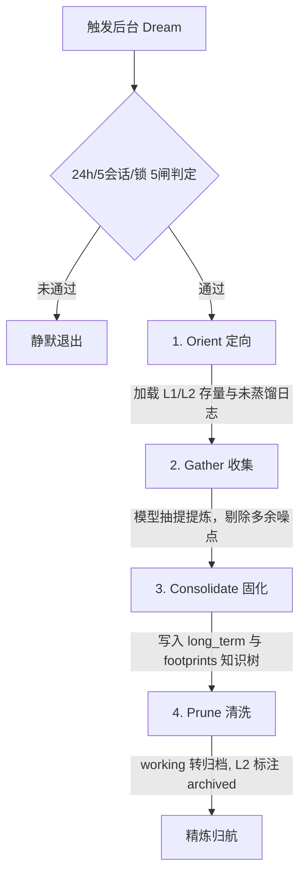

# IST-Core 认知级复合记忆与足迹知识树系统

本文档详细介绍了 InfoTest Engine / IST-Core 核心的记忆子系统。该系统设计致力于将短暂的模型上下文转换为持久的、可进化的长短期知识闭环，不仅能自主沉淀会话偏好，还能自动化地将零散交互精炼为结构化的产品事实树。

---

## 一、 三层记忆架构的设计与分布

为了在保障处理效率的同时实现认知进阶，IST-Core 采用了创新的三层分级式记忆架构：

| 记忆层级 | 存储路径 | 注入点与生命周期 | 写入触发机理 | 功能职责 |
| :--- | :--- | :--- | :--- | :--- |
| **L1 局部工作记忆** (Working Memory) | `memory/working/<thread_id>.md` | 位于每轮 User 消息前的 `<memory-context>` 中。线程级隔离，随会话流转。 | 由 `MemoryWriteMiddleware` 结合决策判别进行快速增量写入。 | 记录本会话正在开展的具体子任务、分析进度和未解决的阻碍点。 |
| **L2 持久长期记忆** (Long-Term Memory) | `memory/long_term/{preferences,feedback,project,reference}/*.md` | 基于自然语言相关性，在冷启动或每轮交互时通过 Top-K (=3) 向量相关或关键词检索注入上下文。 | 周期性由大模型背景异步精炼（Dreaming）触发产生。 | 跨越会话边界，固化用户的个性化反馈、特定产品偏好及通用的参考规则。 |
| **L3 项目指令集** (Project Agent Guide) | `memory/AGENTS.md` | 在初始化智能体及组装核心 System Prompt 时，直接作为系统级骨架注入。 | 异步 Dream 编译或人工专家调优合并。 | 锚定智能体的大方向原则，作为指导 IST-Core 思考与调用的核心行事纲领。 |

---

## 二、 异步 Dreaming 的五闸四阶段闭环

为了避免在前台评审任务中因长期记忆抽取与清理引入大模型昂贵的延迟（Latency）及并发死锁，IST-Core 设计了完全异步的后端**“庄周梦蝶（Dreaming）”**机制。

### 1. 启动五道安全闸门与准入规则
Dream 任务在定时器或定时脚本触发时，必须连续通过五重逻辑闸门判定才可执行：
1. **功能开关判定**：环境变量 `IST_DREAM_ENABLED=1`。
2. **冷却窗口机制**：距离上次 Dream 任务执行完毕必须超过至少 24 小时（或设定观察期）。
3. **时段运行约束**：只在后台线程空闲或设定低峰期进行（如定时调度，或自上次交互 10 分钟后）。
4. **会话阈值限制**：自上次蒸馏以来，必须累积了至少 5 个及以上的有效会话记录（`IST_DREAM_MIN_SESSIONS`）。
5. **单例文件锁机制**：利用文件级 `fcntl` 锁或 PID 锁定控制，确保同一磁盘根路径下绝无两个并发 Dream 进程打架。

### 2. 精炼蒸馏的四大核心运作阶段
一旦通过准入口，Dream 任务将顺次启动四大核心动作，利用专有的模型（`IST_HAIKU_MODEL`）不带副作用地操作后台记忆库：

- **第一阶段：Orient（阶段定向）**
  锁定当前线程的所有 `working/` L1 工作记忆指针，计算未收敛的对话序列，建立知识抽提范围图谱。
- **第二阶段：Gather（碎片收集）**
  将那些尚未固化的临时 L1 记忆内容读取，剔除聊天中的语气词、无用语境，并将相关的上下文证据段按时间线排序，交给专属的 Extractor 模型处理。
- **第三阶段：Consolidate（知识合并）**
  1. **意图升级**：提取 L1 中提及的跨会话偏好（“用户不喜欢使用 full 模型测试，偏好 light”）转写为 L2 `preferences.md` 或 `feedback.md`。
  2. **提炼 AGENTS.md**：将普遍存在的系统执行障碍总结到 L3 指令。
  3. **Footprint 事实捕获**：抽取会话中成功验证的系统语法、CLI 规则、API 返回特征，并启动 Footprint 知识树合并。
- **第四阶段：Prune（归类清洗）**
  执行完合并后，将大于 7 天的活跃 L1 工作记忆转移存盘到 `working/.archive/` 目录；对带有过期寿命或被更正的 L2 记忆元素打上 `archived: true` 标签，实现长短期数据动态衰减。

---

## 三、 Extractor Subagent 的隔离提炼实现

为了确保记忆抽提不破坏正在运行的业务主进程，提炼行为不在主图 (`build_ist_core_graph`) 的核心节点中就地发生。相反，它由 `ExtractorAgent`（提炼子智能体）托管。

### 1. 隔离安全
- **专用 Subagent 沙箱**：提炼子智能体采用限制性极强的 System Prompt。
- **禁止通用工具**：禁用写文件、本地 bash 执行等高危读写外部工具，其唯一的输出出口就是格式化的 frontmatter 语法内存结构。
- **5-Turn 控制限额**：子智能体推理逻辑限定在 5 回合以内，到达上限直接强制截断并进行妥协提炼，避免在前台引起由于不确定模型循环引起的雪崩。

---

## 四、 Footprint（足迹）产品知识树

传统的 RAG 检索面临冷启动困难、缺乏长效验证事实及噪声过高的问题。IST-Core 通过**足迹知识树（Footprints）**给出了最佳工程解。

### 1. 结构化前缀路由逻辑
在 Dreaming 清洗阶段，所有被沉淀下来的产品行为事实，会按照其绑定的 CLI 命令行、接口、或系统前缀进行命名。例如一个经过模型测试成功的命令 `show ipv6 ospf vlink`，知识提取器会将其 token 剥离：
- 滤除 `show/clear/no` 等交互修饰词。
- 提取主体词。
- 按前缀聚合分类。
  - **`leaf`（叶节点）**：聚合公共 Token 大于等于 2 的命令。
  - **`trunk`（主干节点）**：模块下的多种交叉命令分支。
  - **`branch`（分枝节点）**：跨多干的通用操作规范。

知识树动态沉淀并持久化保存在目录 `knowledge/footprints/` 下的 JSON 文件中。

### 2. lookup_footprint 与内存单例单速检索
- **单例 FootprintIndex**：懒加载索引层。首次调用时，在 50ms 内即可将数百个 JSON 节点序列化并缓存在后台内存。
- **注入与主动查询双通道**：
  1. 在 `MemoryInjectionMiddleware` 作用下，每轮对话会自动提取用户输入中的 CLI 模式树并 top-k 自动注入上下文。
  2. IST-Core 触发特定评审任务时，大模型能够通过自带的 `qa_footprint_lookup` 工具直接对特定 CLI 指令组进行高效率的“完全一致性”精准路由检索。
