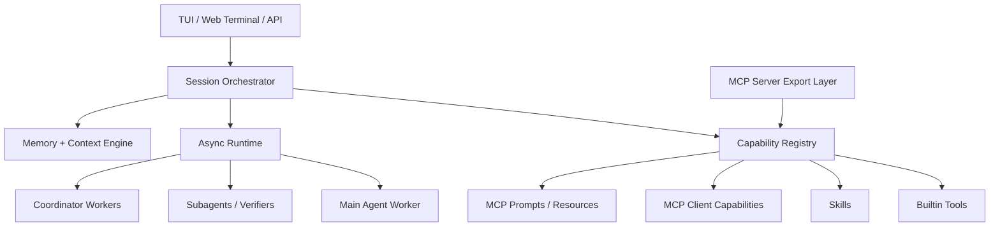

# IST-Core V2 完整框架设计与 MCP 对齐方案

本文档把四类设计输入收口为一个可实施的团队级框架方案：

- 业界 agent harness 能力模型
- LangChain / LangGraph / deepagents 官方能力模型
- 业界参考实现中的有效工程模式
- 当前 IST-Core 代码与已有差距

定位变化：IST-Core 已是**团队项目**，目标不再是"补一个 MCP 功能"，而是在保留
LangGraph + deepagents 投资的前提下，把它升级为**完整、可扩展、可对外的 agent
framework**：

- 完整 MCP client（基于官方 SDK + langchain-mcp-adapters，不自造传输层）
- 完整 MCP server（对外导出受控的知识/评审能力）
- 统一 capability registry（builtin / skill / subagent / MCP 同层）
- 事件流优先的 async runtime（收编现有 EventBus，不另起一套）
- 缓存友好的分层 prompt（面向**自动前缀缓存**，非 Anthropic 断点）
- coordinator 多 worker 并发编排
- 现有 memory / sandbox / review 体系平滑迁移

## 0. 关键事实校准（落地前必读）

本方案修正了上一版的若干误判，全部经代码与官方文档核对：

### 0.1 当前 graph 是 5 节点，不是 4 节点

实测 `main/ist_core/graph.py:554-577`：

```
START -> normalize_input -> qa_node -> review_gate -> finalize -> END
```

`review_gate` 是条件节点（`main/ist_core/nodes/review_gate.py`），按 `gate_status`
分流：`passed/failed -> finalize`，`pending -> qa_node`（评审回环）。任何对 graph
的"降级为 adapter"改造都必须保留这条回环，否则评审 gate 失效。

### 0.2 已存在 EventBus，RuntimeEvent 必须收编它而非平行新增

`main/ist_core/events.get_default_bus()` 已是事实事件总线，`graph.py` 的
`_MainAgentProgressHandler`（graph.py:73-354）就是 LangChain callback → EventBus 的桥。
V2 的 `RuntimeEvent` 是这条总线的**规范化 schema 层**，不是第二套总线。

### 0.3 主 agent 是进程级单例，与"动态 MCP 工具"硬冲突（V2 第一难点）

`graph.py:34-42` 的 `_get_main_agent()` 把 agent 缓存成进程级单例，
`create_deep_agent()` 一次性吃定 tools/subagents。而 MCP 的 `list_changed` /
按 session 合并 server scope 要求工具集**运行时可变**。

这是 deepagents 路线做 MCP 的核心摩擦点，V2 必须正面解决（见 §5.4）：
agent executor 不再做进程级单例，改为**按 capability 指纹缓存的 session 级 agent**——
capability view 变了（连/断 MCP server、启停 skill），指纹变，executor 重建；
指纹不变则复用，保住前缀缓存。

### 0.4 不切 Anthropic 端点（已核对官方文档）

DeepSeek 提供 Anthropic 兼容端点（`https://api.deepseek.com/anthropic`），但：

- **`cache_control` 在该端点被完全忽略**——拿不到任何手动缓存控制能力。
- `mcp_servers` 字段被忽略，MCP content type 全部 Not Supported——MCP 必须 client 侧解决。
- image/document 输入、`redacted_thinking` 等不支持；`anthropic-beta`/`version` header 忽略。

结论：切 Anthropic 端点零增量、还掉 feature。**维持现有 OpenAI 兼容端点**
（DeepSeek native / DashScope compat），与 CLAUDE.md"Anthropic 兼容路径已移除"一致。

### 0.5 MCP 一律走官方 SDK + langchain-mcp-adapters，不自造传输层

- 官方 `mcp` Python SDK 提供 client/server 全部 transport（stdio / streamable HTTP /
  SSE）、协议握手、`list_changed`、elicitation、roots 原语。
- `langchain-mcp-adapters` 把 MCP server 的 tools 直接转成 LangChain `Tool`，
  可直接喂给 `create_deep_agent(tools=...)`；resources/prompts 用 SDK client 原生取。

因此 §6/§7 不写"自建 transports/"，写"在 SDK 之上做配置、策略、生命周期、UX 适配"。
WebSocket 不是 MCP spec 重点，移出"必须支持"。

> Phase 0 第一件事：验证 `mcp` SDK + `langchain-mcp-adapters` 与锁定的
> `deepagents>=0.5.3,<0.6` / `langchain>=1.2.15` / `langgraph>=1.1` 版本兼容性，
> 不兼容则评估升级 deepagents 或薄封装 SDK，**不退回自造传输层**。

### 0.6 Prompt 分层面向"自动前缀缓存"，删掉 Anthropic 断点语义

DeepSeek/DashScope 是**自动 server-side 前缀缓存**：无需任何标注，前缀字节级命中即生效，
`usage` 回传 `prompt_cache_hit_tokens` / `prompt_cache_miss_tokens`（命中便宜 10×，
最小单位 64 token）。所以 §9 保留分层（稳定前缀=高命中），但：

- 删除所有 `cache_control` / ephemeral 断点写法——对本项目端点无效。
- 目标改为"保持前缀字节稳定，易变内容后置"。
- 可观测指标用现成的 `prompt_cache_hit_tokens`，不造"cache miss 率"虚指标。

## 1. 结论先行

当前 IST-Core 是一个以 deepagents 为执行内核、LangGraph 为持久化骨架、TUI/Web
Terminal 为交互层的单主代理系统。它已具备：主 graph + checkpoint、主 agent + 1 个内联
subagent、memory（working/long_term/footprint）、多根沙箱、skills、review gate。

距离"完整 agent framework"有五个决定性缺口：

1. 没有 MCP client runtime（仅 slash_commands 有解析残留）
2. 没有把自身能力暴露为 MCP server
3. 没有统一 capability registry，builtin/skill/subagent/MCP 各自割裂
4. 没有事件流优先的异步任务运行时（EventBus 已在，但只是 callback 转发，无任务对象）
5. 没有 coordinator 多 worker 编排层

团队项目定位下，V2 方向是引入统一 **capability-runtime** 架构，让 MCP client/server、
subagent、hook、verification、background task、coordinator 落在同一执行平面。
但关键的 transport / 缓存控制 / agent 装配三件事**复用现成轮子**，不重造（见 §0）。

## 2. 当前代码基线与问题定位

真实控制面文件：

- `main/ist_core/graph.py`（5 节点 + EventBus 桥）
- `main/ist_core/nodes/review_gate.py`（评审回环）
- `main/ist_core/agents/main_agent.py`（`_default_generic_tools()` + 单 explore subagent）
- `main/ist_core/agents/_prompt.py`（12 段顺序拼接）
- `main/ist_core/memory/middleware.py`（注入 + 写入 + distill）
- `main/ist_core/tools/_shared/metadata.py`（静态 TOOL_METADATA dict）
- `main/ist_core/tools/skills/__init__.py`（discovery + invocation 合一）
- `main/ist_core/tui/slash_commands.py`（`is_mcp`/`source:"mcp"` 解析残留，无运行时）
- `main/ist_core/tui/cli.py`（无 mcp 子命令）
- `main/ist_core/web_server.py`（Web Terminal，非 MCP server）
- `main/ist_core/events.py`（EventBus 单例，已是事实事件总线）

### 2.1 graph 层

`build_ist_core_graph`（graph.py:540）装配 5 节点 + review_gate 条件回环。
外层 graph 负责持久化（三级 checkpointer：Postgres→SQLite→InMemory）与 EventBus 桥接，
不负责能力编排。缺：capability discovery / MCP state / task scheduler / worker graph。

### 2.2 main agent

`build_main_agent`（main_agent.py:270）用 `create_deep_agent()` 一次性装配
`_default_generic_tools()`（8 个 builtin 工具）+ 1 个 `explore` subagent +
`interrupt_on`（仅按 `IST_INTERRUPT_ON` env 做简单 HITL）。缺：MCP tool provider、
按 source 统一管理工具、subagent 作为可调度 runtime registry 实体。
**且 agent 是进程级单例（§0.3），动态工具无处可插。**

### 2.3 prompt

`_prompt.py` 把 12 段（identity / readonly boundary / fork skill brief / when-not-to-use
subagent / skills-first / task tracking / exploration workflow / evidence discipline /
reading-vs-verification / faithful reporting / communication style / tool usage）顺序
`"\n\n".join()`。缺：static/session/turn 分层、subagent prompt 继承规则、
verifier/coordinator/worker 的 prompt 契约。

### 2.4 memory

`middleware.py` 已接近正确：`MemoryInjectionMiddleware`（注入 working + long_term key/
语义 + footprint）+ `MemoryWriteMiddleware`（after_model 写 working + distill 触发 fork
agent）。缺：与 task/subagent/coordinator/MCP session 的统一 thread/session 建模；
worker memory 与 shared session memory 边界；MCP resource snapshot / 大工具输出卸载的
统一上下文卸载体系。

### 2.5 slash / CLI / web server

`slash_commands.py` 有 `is_mcp` 字段 + `source: Literal["builtin","plugin","mcp"]` +
`(MCP)` marker 检测，但 `is_mcp` 解析后从不参与 dispatch——纯残留。`cli.py` 无 mcp
子命令。`web_server.py` 是 xterm.js + WebSocket PTY，非 MCP server。

结论：仓库不存在真正 MCP client/server，只有语义残留与扩展位。

## 3. 外部设计基线

### 3.1 业界 agent harness 基线

1. agentic loop 是 harness，不是单 agent
2. MCP 是一等能力，不只是远程工具集合
3. fresh subagent / fork subagent / agent team 都是上下文管理手段
4. prompt caching 决定中长会话成本（**注意：CC 是 Anthropic 断点缓存，我们是自动前缀缓存，
   机制不同、目标相同——稳定前缀**）
5. hook / permission / elicitation / session event 进入统一生命周期

关键结论可直接吸收：MCP tools/resources/prompts 统一进可发现能力面；tool search /
deferred loading 是大规模 MCP 的必要条件；server 连接或 tool list 变化影响前缀稳定性
（进而影响缓存命中）；subagent 分 fresh 与 fork；hooks 是 runtime lifecycle 一部分。

### 3.2 deepagents / LangGraph 基线

deepagents 是 harness 底盘（planning / context compression / filesystem backend /
skills / subagents / HITL），继续作为 V2 agent execution engine。LangGraph 是 durable
runtime（durable execution / streaming / interrupt-resume / memory store / graph
orchestration）。V2 不推翻这两者，在其上加 capability layer 与 runtime layer。

### 3.3 工程模式基线

吸收三个工程方向（不吸收语言/具体实现）：

1. AsyncGenerator 主架构——事件流优先，而非阻塞式 `agent.invoke`
2. 缓存友好的 prompt 工程——**对我们=稳定前缀**（自动前缀缓存），非 Anthropic 断点
3. coordinator 多 worker 编排——子任务/worker 作为真正 runtime object

加上它已有的 MCP client 集成思路，得出 V2 核心：MCP capability 与 agent capability 同层注册。

## 4. V2 总体目标：四层架构



设计原则：

- 保留 LangGraph durable state runtime + deepagents agent harness
- MCP transport / 缓存控制 / 工具适配三件事复用现成轮子（§0.5、§0.6）
- 新增 session orchestrator + capability registry
- 所有能力统一抽象为 capability，不再区分"是不是本地工具"
- 所有长流程走 event stream（收编 EventBus），不一次性阻塞
- 所有 prompt 分层装配，目标稳定前缀以吃自动缓存

## 5. 统一 Capability Registry

V2 第一优先级是统一 capability 模型，不是 MCP transport。

新增包：

- `main/ist_core/capabilities/models.py`
- `main/ist_core/capabilities/registry.py`
- `main/ist_core/capabilities/resolver.py`
- `main/ist_core/capabilities/policies.py`
- `main/ist_core/capabilities/agent_factory.py`（§5.4 的 capability 指纹 + agent 缓存）

### 5.1 统一 capability 类型

所有能力归一：builtin_tool / skill / subagent / verifier / coordinator_worker /
mcp_tool / mcp_resource / mcp_prompt / exported_tool / exported_resource / exported_prompt。

```python
class CapabilitySource(str, Enum):
    BUILTIN = "builtin"; SKILL = "skill"; SUBAGENT = "subagent"
    MCP = "mcp"; EXPORTED = "exported"

class CapabilityKind(str, Enum):
    TOOL = "tool"; RESOURCE = "resource"; PROMPT = "prompt"; AGENT = "agent"

@dataclass(frozen=True)
class CapabilityDescriptor:
    id: str
    name: str
    source: CapabilitySource
    kind: CapabilityKind
    title: str
    description: str
    input_schema: dict | None
    output_schema: dict | None
    tags: tuple[str, ...]
    risk_level: str            # low|medium|high|critical（对齐 §11.2）
    always_load: bool = False  # 是否 upfront 注入 prompt（否则 deferred）
    provider: str = ""         # MCP server 名 / skill 名
    provider_ref: str = ""     # mcp tool 原名 / SKILL.md 路径
    fingerprint: str = ""      # 进 capability 指纹（§5.4）
    runtime_policy: dict | None = None
```

`frozen=True` 是为了 descriptor 可哈希，直接参与 §5.4 的指纹计算。

### 5.2 registry 职责

- 聚合 builtin / skill / subagent / MCP server 能力
- 去重、命名空间、优先级、alias
- 决定 upfront vs deferred（`always_load`）
- 提供 tool/resource/prompt search（deferred loading 入口）
- 向 prompt assembler 输出 capability summary（稳定排序，见 §9）
- 向 runtime 输出 invoker（统一过 policy engine §11）

### 5.3 对现有代码的改造

- `tools/_shared/metadata.py`：静态 TOOL_METADATA → **builtin capability adapter**
  （把 11 个 builtin 工具映射成 CapabilityDescriptor），不再当全局元数据中心。
  顺带补 `qa_invoke_skill` 缺失的 metadata 条目。
- `tools/skills/__init__.py`：拆成 `discovery`（产出 skill CapabilityDescriptor）+
  `invocation`（只负责执行）。
- `agents/main_agent.py`：不再手搓 tools list，向 registry 请求当前 session 的
  capability view，再交给 `agent_factory`（§5.4）。

### 5.4 capability 指纹 + session 级 agent 缓存（解决 §0.3 单例冲突）

这是 V2 能把 deepagents 与动态 MCP 工具调和的关键机制，必须先于 MCP client 落地。

问题：`create_deep_agent()` 一次吃定 tools，进程级单例无法热更；但 MCP 连接/断开、
skill 启停、worker scope 限制都会改变工具集。

方案：

```python
# agent_factory.py（示意）
def capability_fingerprint(view: CapabilityView) -> str:
    # 对 (id, name, source, input_schema_hash) 排序后 sha256
    # 仅纳入"影响 agent 装配"的字段；不纳入易变 metadata
    ...

_AGENT_CACHE: dict[str, CompiledAgent] = {}

def get_agent_for(view: CapabilityView):
    fp = capability_fingerprint(view)
    if fp not in _AGENT_CACHE:
        tools = view.as_langchain_tools()      # builtin + skill + mcp(adapters 转换)
        subagents = view.as_subagent_specs()
        _AGENT_CACHE[fp] = create_deep_agent(tools=tools, subagents=subagents, ...)
    return _AGENT_CACHE[fp]
```

要点：

- **指纹不变 → 复用同一 compiled agent → system prompt 前缀稳定 → 命中自动前缀缓存**。
  这正是 §9 分层与缓存的落点：capability summary 进 prompt 时按指纹同序渲染。
- 指纹变（连了新 MCP server / 启用新 skill）→ 重建，并 emit `capability.changed` 事件，
  prompt assembler 重算 session dynamic layer。这是一次"主动失效"，可接受。
- 缓存键含 MCP server scope，使 §10 worker 的"独立 MCP 子集"自然落到不同 agent 实例。
- `graph.py:_get_main_agent()` 从"进程单例"改为"调 `agent_factory.get_agent_for(view)`"，
  `qa_node` 在调用前先向 registry 取当前 session 的 view。

> 风险：MCP `list_changed` 频繁触发会导致频繁重建 + 缓存失效，伤命中率。缓解：对
> list_changed 做去抖（debounce），并把 deferred 工具（§6.4）排除在指纹外——它们不进
> upfront 装配，只在 search/call 时按需拉，不影响 agent 重建。

## 6. MCP Client 设计（基于官方 SDK + langchain-mcp-adapters）

新增包（**注意：无 `transports/`，传输交给官方 SDK**）：

- `main/ist_core/mcp_client/config.py`     —— 三层 scope 配置解析
- `main/ist_core/mcp_client/manager.py`    —— 连接生命周期 + 状态机（封装 SDK ClientSession）
- `main/ist_core/mcp_client/discovery.py`  —— tools/resources/prompts 拉取 → CapabilityDescriptor
- `main/ist_core/mcp_client/adapters.py`   —— langchain-mcp-adapters 封装：MCP tool → LangChain Tool
- `main/ist_core/mcp_client/invoker.py`    —— resources/read + prompts/get（adapters 不覆盖的部分）
- `main/ist_core/mcp_client/elicitation.py`—— elicitation → LangGraph interrupt 桥
- `main/ist_core/mcp_client/tool_search.py`—— deferred loading 的 search 入口

### 6.1 支持范围

transport（由官方 SDK 提供，我们只配置）：

- stdio（本地集成）
- streamable HTTP（远程）
- SSE（兼容旧 server）
- ~~WebSocket~~ —— 非 spec 重点，移出 V2 必须项；有真实需求再说

能力面（SDK 原生支持，我们做 discovery + adapter）：

- tools/list、tools/call
- resources/list、resources/read
- prompts/list、prompts/get
- list_changed 动态刷新（接 §5.4 去抖重建）
- roots/list、elicitation

### 6.2 配置模型（三层 scope）

配置三层合并（session > user > project）：

- `.ist/mcp.json` —— 项目共享（**团队项目，进 git**）
- `runtime/users/{user}/mcp.json` —— 用户私有（不进 git）
- session 内存配置 —— 临时覆盖

字段：`name` / `type` / `command` / `args` / `env` / `url` / `headers` /
`headers_helper` / `oauth` / `timeout_ms` / `always_load` / `allowed_tools` /
`denied_tools` / `allowed_resources` / `denied_resources` / `tags` / `instructions`。

> 团队场景重点：`.ist/mcp.json` 不得含明文密钥。密钥走 `env` 引用 +
> `environment` 文件（已在 .gitignore）或 `headers_helper` 取值，与 §0/CLAUDE.md 的
> Token 安全约束一致。

### 6.3 连接管理与状态机

`McpClientManager` 封装 SDK 的 `ClientSession`，负责：session 启动并发连接、背景重连、
capability 刷新、认证状态 + OAuth 回调、list_changed 增量刷新（→ §5.4 去抖）。

状态机：`configured → connecting → auth_required → connected → degraded → failed →
blocked_by_policy`。状态变化 emit RuntimeEvent（§8.2），TUI/Web 实时显示。

### 6.4 deferred loading（避免上下文被 MCP schema 吞掉）

- session 启动只注册 server summary + tool names summary（进 §9 session dynamic layer）
- 详细 schema 延迟到首次 search/call 时拉取
- 提供 `qa_mcp_tool_search` / `qa_mcp_resource_search` / `qa_mcp_prompt_search`
- deferred 工具**不进 §5.4 capability 指纹**，故不触发 agent 重建、不伤前缀缓存

### 6.5 MCP prompt / resource 的 UX

把 slash_commands 残留升级为正式实现：

- `/mcp` —— server 管理视图（连接状态、tool 列表、auth）
- `/mcp__server__prompt arg1 arg2` —— 执行 MCP prompt（走 SDK `prompts/get`）
- `@server:scheme://resource` —— 引用 MCP resource（走 SDK `resources/read`）

改造：`slash_commands.py` 从"解析残留"升级为真实 **command source router**
（`is_mcp` 字段终于被 dispatch 消费）；TUI 与 Web Terminal 都支持 resource mention
autocomplete。

### 6.6 elicitation：复用 LangGraph interrupt，不另起阻塞 I/O

MCP elicitation 映射到现有 LangGraph interrupt/resume：

- runtime 发 `mcp.elicitation.requested`（带 schema）
- UI 渲染表单 / OAuth URL 对话框
- 用户提交 → runtime resume，发 `mcp.elicitation.resolved`

这复用 graph 已有的 checkpoint/interrupt 能力（§2.1 的 AsyncSqliteSaver 路径），
不写第二套阻塞 ask-user。

### 6.7 安全策略（统一过 policy engine §11）

每个 MCP server 支持：allowlist/denylist、风险等级、tool confirmation policy、
输出截断 / 落盘卸载、prompt injection 标记、审计日志。所有 MCP tool 调用经统一 policy
engine，不直通 deepagents tool。

> 团队项目重点：MCP server 返回内容是**不可信外部数据**。adapters 转出的 tool 在
> invoker 层统一做 prompt-injection 标记 + 输出截断/落盘，与现有 `large_tool_results/`
> 卸载机制对接。

## 7. MCP Server 设计（基于官方 SDK）

新增包（**transport 用 SDK，不自造**）：

- `main/ist_core/mcp_server/server.py`          —— FastMCP/低阶 Server 装配
- `main/ist_core/mcp_server/session.py`         —— MCP client session ↔ IST session 映射
- `main/ist_core/mcp_server/export_registry.py` —— 受控导出能力清单
- `main/ist_core/mcp_server/resources.py`       —— resource 导出
- `main/ist_core/mcp_server/prompts.py`         —— prompt 导出

### 7.1 server 目标

IST-Core 自身可作为 MCP server 暴露给外部 host / 其他 agent。导出**受控能力**，
不是把整个 TUI 套出去。团队场景：组内其他工具 / CI / 平台可把 IST-Core 当作专业
"测试资产 + 知识分析 server"调用。

### 7.2 建议导出的 tools

第一阶段（只读、可审计、可解释）：`ist_read_file` / `ist_grep` / `ist_glob` /
`ist_ls` / `ist_review_case` / `ist_review_asset` / `ist_search_knowledge` /
`ist_lookup_footprint` / `ist_run_skill`。

第二阶段（编排）：`ist_run_subagent` / `ist_plan_task` / `ist_resume_task` /
`ist_check_task_status`。

导出原则：默认只导出安全/可审计能力；**不暴露任意 shell 执行**；**不暴露工作区任意写入**。
第二阶段编排类工具默认关闭，按 server 配置显式开启。

### 7.3 建议导出的 resources

knowledge 文档索引 / footprint tree / memory summary / runtime task list /
current session summary。

### 7.4 建议导出的 prompts

review-test-case / summarize-knowledge-topic / inspect-cli-command /
analyze-defect-impact。

### 7.5 transport（SDK 提供）

至少 stdio（本地集成）+ HTTP（远程 / 组织内网）。CLI：

- `infotest mcp serve`
- `infotest mcp serve --transport http --port 8765`

改造：`cli.py` 增加 mcp 子命令树；`web_server.py` **不**改造成 MCP server，而是新增
独立 server entry，复用其 auth / session 组件。

### 7.6 会话模型

不每次 tool call 新建主 agent。每个 MCP client session 映射一个 IST session，
独立 memory view / task registry / audit trail，支持 resume/reconnect。
与 §5.4 的 session 级 agent 缓存对齐：同 session 同 capability 指纹复用 agent。

### 7.7 用户确认责任边界

IST-Core 作为 server 暴露工具时不替客户端做最终 UI 确认，而是：tool metadata 暴露
风险级别、支持 server-side policy deny、返回需要确认的 structured signal。最终由 host
决定如何向用户确认。

## 8. Async Runtime（收编 EventBus，不另起一套）

新增：

- `main/ist_core/runtime/events.py`     —— RuntimeEvent schema（规范化 §0.2 的 EventBus）
- `main/ist_core/runtime/session.py`    —— session orchestrator
- `main/ist_core/runtime/tasks.py`      —— TaskRegistry
- `main/ist_core/runtime/dispatcher.py` —— command/resume/cancel 分发
- `main/ist_core/runtime/streaming.py`  —— AsyncIterator 封装
- `main/ist_core/runtime/background.py` —— 后台任务

### 8.1 为什么要 AsyncGenerator 风格

当前 `qa_node` 是 `agent.invoke()` 同步阻塞（graph.py:398），靠
`_MainAgentProgressHandler` 把中间态转发 EventBus。问题：子任务 / background / MCP
elicitation / worker idle 都被打散成补丁；任务本身不是可恢复对象。

V2 把 session 执行统一为：

```python
async def run_session_turn(...) -> AsyncIterator[RuntimeEvent]:
    ...
```

只做两件事：消费 command/resume/cancel；产出 event。

> 重要：这**不是**抛弃 LangGraph 的 `astream_events`。`qa_node` 内部仍可调
> deepagents，但外层 session orchestrator 优先用 LangGraph 原生 `astream_events` 拿
> 事件，`_MainAgentProgressHandler` 退化为"adapters 覆盖不到的回调"的补充桥，
> 不再是主路径（见 §8.3）。

### 8.2 统一 RuntimeEvent（规范化现有 EventBus）

`RuntimeEvent` 是 `events.py` EventBus 的 typed schema 层，事件族：

```
session.started / session.turn.started / session.turn.completed
prompt.assembled / model.thinking
tool.call.requested / started / completed / failed
mcp.server.connecting / connected / degraded / failed
mcp.elicitation.requested / resolved
capability.changed                         # §5.4 agent 重建触发
subagent.started / progress / completed
worker.started / idle / completed
verification.started / completed
task.created / updated / completed
memory.injected / distilled
context.compacted
```

迁移要求：现有 `bus.emit(kind, ...)` 的 kind（`llm_end` / `tool_call` /
`tool_result` / `todo_list` / `info`）映射到上述规范事件，**保留旧 kind 作为
deprecated alias 一个版本**，避免 TUI/Web sink 一次性全改。

### 8.3 event bridge 迁移

`_MainAgentProgressHandler` 不再承担最终 runtime 语义，退化为 deepagents adapter：

- LangGraph `astream_events` / deepagents callback → adapter event
- adapter event → 规范化 RuntimeEvent（§8.2）
- TUI / Web / MCP server 都消费规范化 event

### 8.4 统一任务模型 TaskRegistry

`foreground_task` / `background_subagent` / `mcp_pending_auth` / `deferred_tool` /
`worker_task` / `scheduled_wakeup`。TUI、Web、MCP server 共享同一任务视图，支持
resume/cancel（复用 LangGraph checkpoint）。

## 9. Prompt 与上下文工程（面向自动前缀缓存）

新增：

- `main/ist_core/prompts/assembler.py`
- `main/ist_core/prompts/sections/`
- `main/ist_core/prompts/subagents/`
- `main/ist_core/prompts/prefix_policy.py`（**前缀稳定策略，非 cache_control**）

### 9.1 分层目标

三层，目的是让**前缀字节尽量稳定**以命中 DeepSeek/DashScope 自动前缀缓存：

1. **Static System Layer**（几乎不变）：identity / core rules / sandbox contract /
   verification contract / capability classes summary / output style
2. **Session Dynamic Layer**（每会话变、非每轮变）：当前 model/provider / enabled
   skills summary / connected MCP server summary / tool names summary / memory summary
   head / coordinator mode flags
3. **Turn Layer**（每轮变）：user message / active task list / relevant long-term
   memory / recent tool results / selected MCP tool/resource/prompt details

关键：层与层的边界 = 前缀稳定边界。static + session 两层只要不变，前缀就命中缓存；
turn layer 的变化只影响尾部，不破坏前缀。这与 §5.4 capability 指纹同序渲染配合。

### 9.2 前缀稳定原则（替换上一版的 cache_control 原则）

- **删除所有 `cache_control` / ephemeral 断点**——本项目端点忽略它（§0.4）。
- MCP 详细 schema 不进 static layer，走 deferred（§6.4）。
- skill 全文按需注入，不预加载全部正文。
- 大工具输出落盘（对接 `large_tool_results/`），prompt 内只放引用 + 摘要。
- capability summary 必须**确定性排序**（按 id），否则前缀字节抖动、缓存命中归零。
- file changed / context updated 用 system reminder 追加，**不 retroactively 改写历史**
  （改写历史 = 前缀变 = 缓存全失效）。

### 9.3 可观测（用真实指标，非虚构 miss 率）

- 每轮记录 `usage.prompt_cache_hit_tokens` / `prompt_cache_miss_tokens`。
- 命中率 = hit / (hit + miss)，作为 §14.4 回归基线。
- `capability.changed` 事件后允许命中率短暂下探（一次主动失效），监控其是否快速回升。
- DashScope 部分模型不回传缓存明细——此时该指标降级为"不可用"，不阻断流程。

### 9.4 subagent prompt 体系

分三类，不再混成一个 `explore`：

- **fresh subagent**：独立 prompt + 独立 capability subset + 返回总结
- **fork subagent**：继承 parent conversation + 共享前缀（命中缓存）+ 高上下文并行试探
- **worker agent**：coordinator 管理，有明确角色 / 上下文边界 / 生命周期

## 10. Coordinator 多 Worker

新增：

- `main/ist_core/coordinator/manager.py`
- `main/ist_core/coordinator/team.py`
- `main/ist_core/coordinator/worker.py`
- `main/ist_core/coordinator/contracts.py`

### 10.1 目标场景

不是"再加一个 plan subagent"，而是支持：多模块并行调研、多用例并行评审、
多 verifier 并行交叉验证、异构 worker 分工（一个跑 MCP 外部信息、一个跑本地知识库、
一个跑 code inspection）。

### 10.2 worker 类型

researcher / reviewer / verifier / mcp-operator / implementer / summarizer。

### 10.3 worker 契约

每个 worker：role prompt + capability view + task contract + completion contract +
retry policy + escalation policy。

### 10.4 worker 与 MCP

worker capability view 支持独立 MCP server scope：某 worker 带专用 MCP server /
只继承 parent 子集 / 完全禁外部 MCP。这与 §5.4 capability 指纹天然契合——不同
scope = 不同指纹 = 不同 agent 实例，互不污染前缀缓存。

### 10.5 与 deepagents subagent 的关系

第一阶段**不重写 worker executor**，仍复用 deepagents subagent。coordinator 只负责：
任务拆分 / worker spec 生成 / 并行调度（走 §8 runtime 的 parallel task）/ 结果归并。
V2 稳定后再考虑对某些 worker 用自定义 LangGraph graph 替代默认 subagent。

## 11. 权限、安全与审计

新增统一 policy engine：

- `main/ist_core/policy/engine.py`
- `main/ist_core/policy/rules.py`
- `main/ist_core/policy/audit.py`

### 11.1 统一拦截面

builtin tool / MCP tool / exported tool / worker spawn / background task / file write /
shell exec —— 全部过同一 policy。注意与现有沙箱协同：`file_tools.py` 的多根沙箱
（`_agent_roots` / 三闸 / 四闸）是**底层强制**，policy engine 是**上层策略**，
两者叠加不替代——policy 放行后仍受沙箱约束。

### 11.2 统一风险等级

- low：读知识、grep、ls、read resource
- medium：本地写工作区 outputs、低风险 MCP 调用
- high：shell exec、外部写操作、联网 side effect
- critical：凭据、生产系统、不可逆变更

### 11.3 审计日志

所有外部调用可追踪：session_id / task_id / worker_id / capability_id / input 摘要 /
output 摘要 / duration / policy decision。落 `runtime/logs/`，**禁止记录 Token/Key 明文**
（与 CLAUDE.md Token 安全一致）。

## 12. 与现有模块的具体映射

### 12.1 继续保留

LangGraph checkpoint / state persistence、`memory/*`、file sandbox（多根 + 三闸 + 四闸）、
skills 目录与内容、review gate 与 review domain tool、EventBus（被 RuntimeEvent 规范化）。

### 12.2 必须重构

| 文件 | 从 | 到 |
|---|---|---|
| `agents/main_agent.py` | 手工 tools list | registry capability view + agent_factory（§5.4）|
| `agents/_prompt.py` | 单文件 12 段拼接 | layered assembler（§9）|
| `tools/_shared/metadata.py` | 静态 dict | builtin capability adapter |
| `tools/skills/__init__.py` | discovery+invocation 合一 | 拆 discovery / invocation |
| `tui/slash_commands.py` | MCP 解析残留 | command source router（消费 is_mcp）|
| `tui/cli.py` | 无 mcp | mcp 子命令树 + serve 入口 |
| `web_server.py` | Web Terminal | 保留 terminal/auth，新增独立 server entry |
| `graph.py` | 进程单例 + 主执行器 | agent_factory 调用 + session runtime bridge（保留 review_gate）|
| `events.py` | 裸 EventBus | RuntimeEvent typed schema（旧 kind 留 alias）|

### 12.3 新主入口拆分

- `build_main_agent()` —— 只负责 agent executor（被 agent_factory 调用）
- `build_session_runtime()` —— 完整 turn lifecycle
- `build_capability_registry()` —— capability discovery
- `build_mcp_client_manager()` —— MCP 连接
- `build_mcp_server()` —— 外部导出

## 13. 分阶段落地路线（团队项目，调整了顺序）

与上一版的关键差异：**Phase 1 内置 §5.4 agent_factory，且让 MCP client 提前到能尽快
出价值**。先做一个"用户无感纯重构"再等很久才出 MCP 的排法风险高，改为重构与首个 MCP
价值咬合推进。

### Phase 0：接口冻结 + 依赖兼容性验证

交付：capability 数据模型 / RuntimeEvent 模型 / MCP 配置 schema / prompt 分层接口 /
新增包骨架（`capabilities/` `runtime/` `mcp_client/` `mcp_server/` `prompts/` `policy/`）。

**Phase 0 第一关键任务（阻塞后续）**：验证 `mcp` SDK + `langchain-mcp-adapters` 与
`deepagents 0.5.3` / `langchain 1.2.15` / `langgraph 1.1` 版本兼容；产出兼容性结论 +
最小 PoC（连一个 stdio echo server，adapters 转出 tool，喂给 create_deep_agent 跑通）。
不兼容 → 评估升级 deepagents 或薄封装 SDK，**不退回自造传输层**。

### Phase 1：Capability Registry + agent_factory + Prompt Assembler

- 不引入 MCP，先统一 builtin/skill/subagent → registry
- 落地 §5.4 agent_factory（capability 指纹 + session agent 缓存），替换进程单例
- prompt 改 static/session/turn 三层（§9）
- EventBus → RuntimeEvent 规范化（旧 kind 留 alias）

验收：现有功能（含 review gate 回环）不变；prompt 内容等价但分层；
`prompt_cache_hit_tokens` 命中率可观测且不低于改造前。

### Phase 2：MCP Client MVP

- stdio + HTTP（SDK 提供）
- tools/list+call（adapters）、resources/list+read、prompts/list+get
- `/mcp` 管理界面、`/mcp__server__prompt`、`@server:resource`
- list_changed → §5.4 去抖重建
- deferred loading + `qa_mcp_*_search`

验收：接通本地 stdio + 远程 HTTP server；MCP tool 被主 agent 使用；MCP prompt 走
slash command；连/断 server 时前缀缓存命中率按预期波动后回升。

### Phase 3：Async Runtime + Background Tasks

- session turn → AsyncGenerator 事件流；外层优先 `astream_events`
- foreground/background task 统一 TaskRegistry
- subagent / verifier / MCP auth / deferred tool 进统一事件系统

验收：TUI / Web 看到一致任务事件；resume/cancel 可用。

### Phase 4：MCP Server MVP

- 导出只读知识 + 评审工具（§7.2 第一阶段）
- stdio / HTTP；tools/resources/prompts
- session 映射 + audit

验收：外部 client 通过 MCP 调 IST-Core 检索知识 + 执行评审；编排类工具默认关闭。

### Phase 5：Coordinator 多 Worker

- worker registry + 并行 researcher/reviewer/verifier + 结果归并
- worker MCP scope 走 §5.4 指纹隔离

验收：多资产并行评审；多 source 并行调研。

### Phase 6：生产化补齐

OAuth / headers_helper / 重连；list_changed 动态更新打磨；tool search 优化；
审计、策略、压测、回归。

## 14. 测试矩阵

### 14.1 单元测试

capability registry 去重/优先级/alias；**capability 指纹稳定性 + agent 缓存命中/失效**
（§5.4 新增重点）；prompt assembler 分层结果 + 确定性排序；MCP config 三层 scope 合并；
RuntimeEvent 序列化 + 旧 kind alias 映射；policy decision。

### 14.2 集成测试

stdio MCP server 接入（用 SDK 自带 echo/example server）；HTTP MCP server 接入；
adapters 转出的 tool 被 deepagents 调用；elicitation 中断/恢复；list_changed → 去抖重建；
exported server tools/resources/prompts。

### 14.3 端到端测试

TUI 中添加/认证/调用 MCP；Web Terminal 调 MCP prompt/resource；coordinator 并行 worker；
背景任务与 resume；**现有 cookie 121100 评审回归套件**（`scripts.debug.e2e_cookie_review_v2`）
全程跑通，证明 review gate 未退化。

### 14.4 回归测试重点

- 现有 memory 不退化（working/long_term/footprint 注入与写入）
- 现有 file sandbox 不突破（多根 + 三闸 + 四闸回归用例）
- 现有 review skill + review_gate 回环仍可跑通
- **`prompt_cache_hit_tokens` 命中率不低于改造前基线**（§9.3）
- capability.changed 后命中率回升曲线在阈值内

## 15. 最关键的实现取舍

### 15.1 不做的事

- 不抛弃 LangGraph + deepagents
- 不自造 MCP transport（用官方 SDK，§0.5）
- 不切 Anthropic 端点（零增量，§0.4）
- 不用 cache_control 断点（端点忽略，§0.6）
- 不把 MCP 仅做成 slash command 特性
- 不把 coordinator 做成串行 subagent 包装

### 15.2 必须坚持的事

- 先统一 capability + **agent_factory 解决单例**（§5.4），再做 MCP
- 先统一 RuntimeEvent（收编 EventBus），再做 background/coordinator
- 先做 prompt 分层（稳定前缀），再大规模挂 MCP
- 先把权限审计纳入统一 policy（与沙箱叠加），再开放 exported tools

## 16. 最终模块结构

```text
main/ist_core/
  agents/
  capabilities/
    models.py  registry.py  resolver.py  policies.py  agent_factory.py
  coordinator/
    manager.py  team.py  worker.py  contracts.py
  mcp_client/            # 无 transports/，用官方 SDK
    config.py  manager.py  discovery.py  adapters.py
    invoker.py  elicitation.py  tool_search.py
  mcp_server/            # 无 transports/，用官方 SDK
    server.py  session.py  export_registry.py  resources.py  prompts.py
  prompts/
    assembler.py  prefix_policy.py  sections/  subagents/
  runtime/
    events.py  session.py  tasks.py  dispatcher.py  streaming.py  background.py
  policy/
    engine.py  rules.py  audit.py
```

## 17. 里程碑验收标准

- **M1 框架底座**：capability registry + agent_factory（单例已替换）+ prompt assembler
  上线；主 agent 不再手工拼 capability；review_gate 回环不变；缓存命中率不退化。
- **M2 MCP client 可用**：接通至少 1 个 stdio + 1 个 HTTP server；tools/resources/prompts
  全通；`/mcp` 可管理；list_changed 去抖重建生效。
- **M3 runtime 事件化**：foreground/background/subagent/verifier/MCP auth 统一进
  TaskRegistry；TUI / Web 消费统一 RuntimeEvent；旧 EventBus kind alias 仍兼容。
- **M4 MCP server 可对外**：外部 host 能调 IST-Core 的检索与评审能力；编排类工具默认关。
- **M5 coordinator 可并行**：多 worker 并行调研与评审跑通；worker MCP scope 指纹隔离。

## 18. 最终判断

上一版方案的方向（四层架构）成立，但有三处会直接拖垮落地的硬伤，本版已修：

1. **不自造 MCP 传输层** —— 用官方 `mcp` SDK + `langchain-mcp-adapters`，Phase 2 由
   "自建 4 种 transport"缩成"配置 + 适配 + 生命周期"。
2. **prompt 缓存不照搬 Anthropic** —— 本项目端点忽略 `cache_control`，改为面向自动
   前缀缓存的"稳定前缀"策略，用 `prompt_cache_hit_tokens` 度量。
3. **正面解决单例 agent 与动态 MCP 工具的冲突** —— 新增 §5.4 capability 指纹 +
   session 级 agent 缓存，这是 deepagents 路线做 MCP 的前置必答题，必须先于 MCP client。

外加修正：graph 是 5 节点（保留 review_gate 回环）；RuntimeEvent 收编现有 EventBus 而
非平行新增；不切 Anthropic 端点（已核对官方文档，零增量）。

团队项目定位下，整体大框架的加法成立。正确顺序不变：

1. capability registry + **agent_factory（解决单例）**
2. prompt assembler（稳定前缀）
3. MCP client（官方 SDK + adapters）
4. async runtime（收编 EventBus）
5. MCP server（官方 SDK）
6. coordinator 多 worker

这条路线保住 LangGraph + deepagents 投资，把 IST-Core 从"单主代理应用"升级为
"完整可扩展、可对外的 agent framework"，且每一步都复用现成轮子、不重造、不踩端点雷区。
